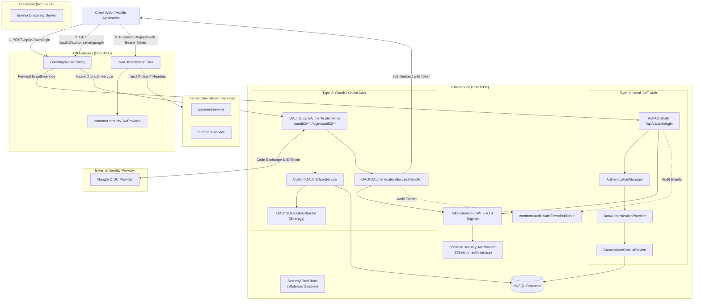
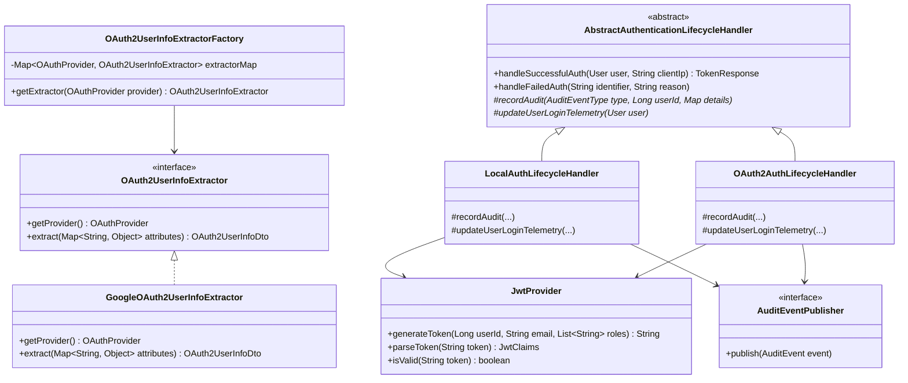
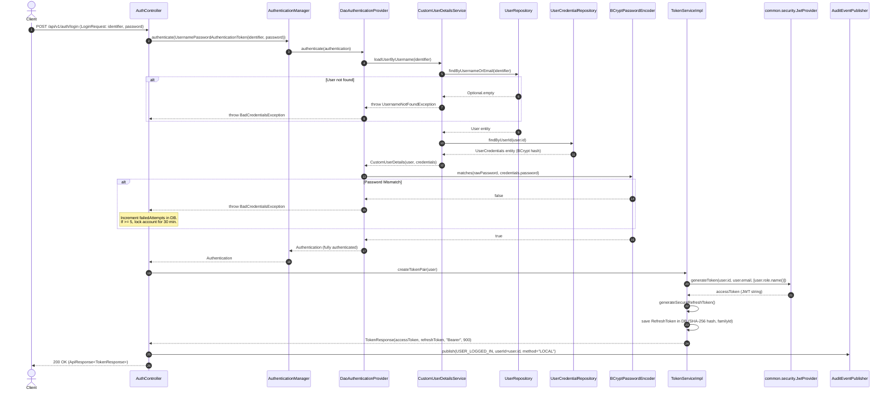
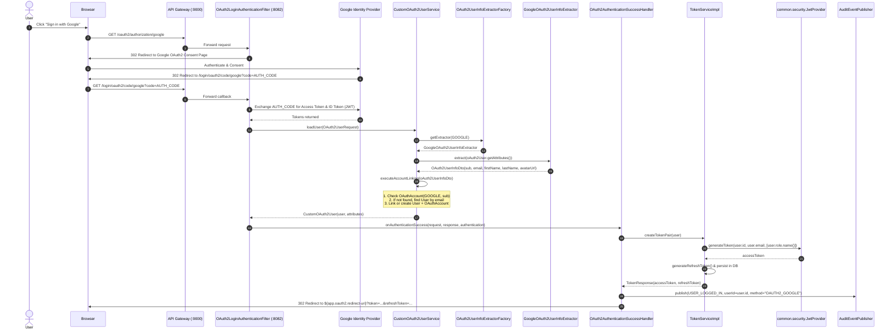
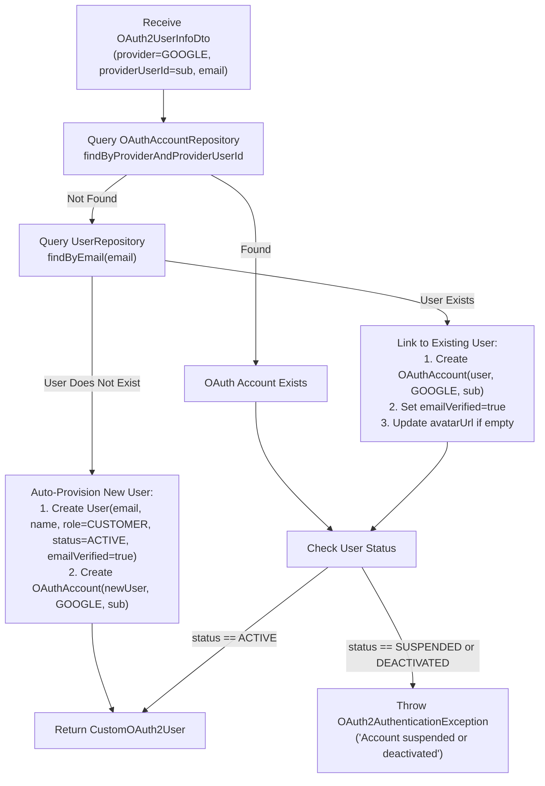
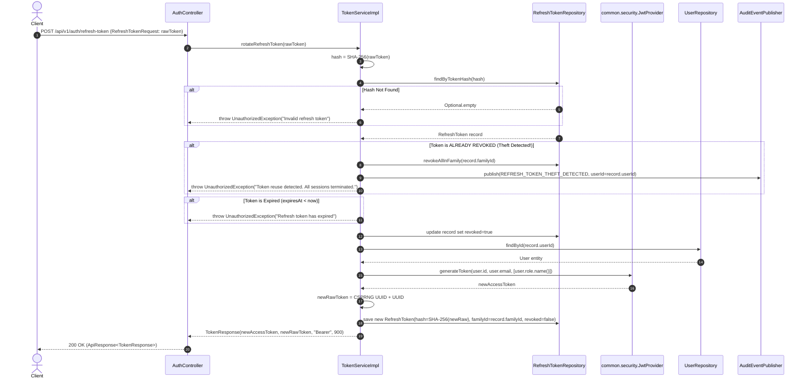
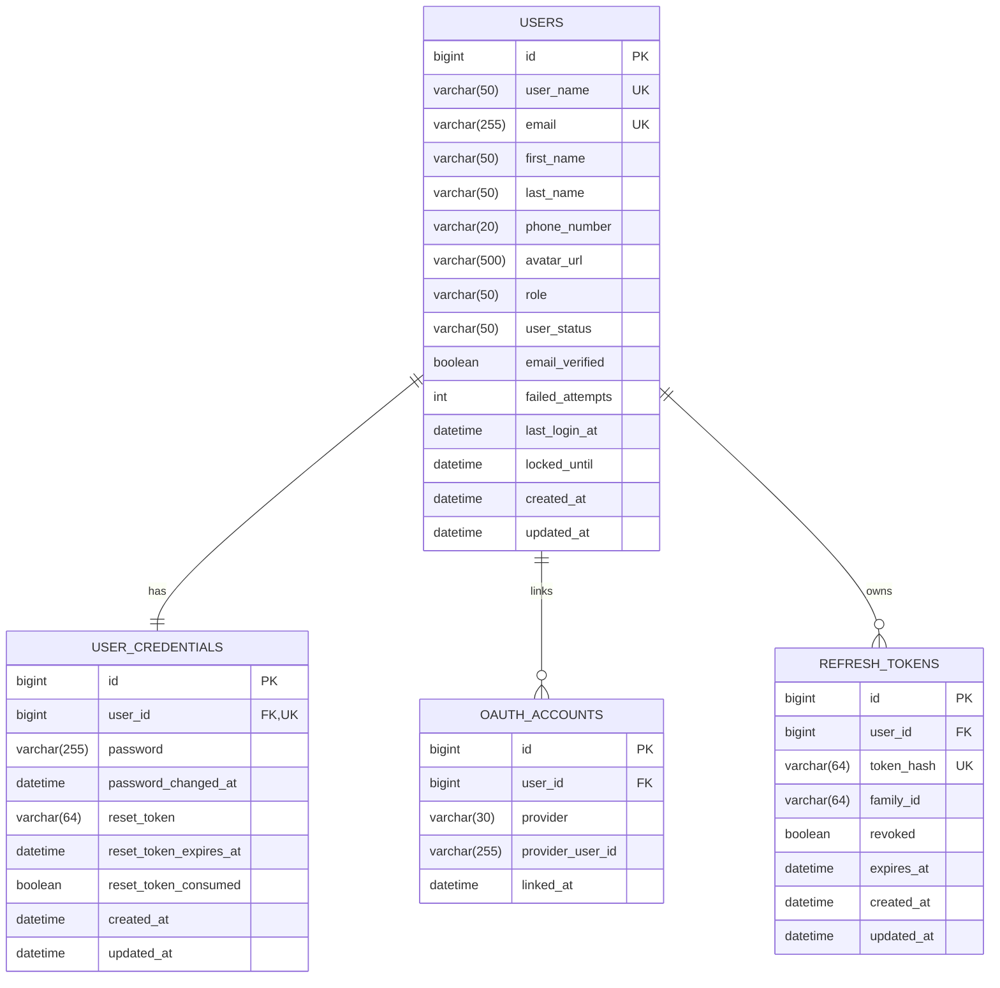

# PayFlow Backend: Low-Level Design (LLD) - Authentication & Identity Service (`auth-service`)
**Module:** `auth-service`  
**Parent System:** PayFlow Distributed Payment Orchestration Platform  
**Target Scope:** Exclusively Dual Authentication (**Local JWT with Spring Security** + **OAuth2 / OIDC Social Login**)  
**Shared Library Integration:** `com.payflow.common.security.JwtProvider` & `JwtClaims`  

---

## 1. Executive Architecture & Scope Definition

The **PayFlow Authentication & Identity Service (`auth-service`)** is redesigned to provide a clean, high-performance, and unified authentication engine supporting strictly **two authentication mechanisms**:

1. **Authentication Type 1: Local Authentication (JWT + Spring Security)**
   - Username/Email + Password authentication evaluated through Spring Security's native `AuthenticationManager` and `DaoAuthenticationProvider`.
   - Passwords secured with `BCryptPasswordEncoder` (cost factor 12).
   - Upon successful credential validation, the service invokes the shared `common.security.JwtProvider` to issue a cryptographically signed Access Token, paired with a secure rotated Refresh Token.
2. **Authentication Type 2: Federated OAuth2 / OIDC Authentication (Google Social Login)**
   - External authentication delegating identity verification to Google via Spring Security's `oauth2Login()`.
   - Automatic account linking, new user auto-provisioning, and conflict resolution.
   - Upon successful OAuth2 authorization code exchange, the custom success handler generates the exact same JWT format using `common.security.JwtProvider` and redirects back to the client application.

### 1.1 Microservices Topology & Zero-Trust Perimeter



---

## 2. Design Patterns Architecture

To ensure clean code, high extensibility, and maintainability, the following design patterns are utilized:



### 2.1 Strategy Pattern: Vendor-Agnostic OAuth2 Claim Extraction
- **Problem**: Different OAuth2 / OIDC identity providers return different attribute keys (e.g., Google uses `sub`, `email`, `picture`, `given_name`; GitHub uses `id`, `login`, `avatar_url`).
- **Solution**: The `OAuth2UserInfoExtractor` strategy interface decouples attribute parsing.
  - `GoogleOAuth2UserInfoExtractor`: Extracts Google OIDC attributes into a normalized `OAuth2UserInfoDto`.
  - Future providers (GitHub, Apple) are added by creating a new strategy class without touching existing services.

### 2.2 Factory Pattern: OAuth2 Extractor Lookup
- **Problem**: Runtime lookup of extractors based on the client registration ID (`google`, `github`).
- **Solution**: `OAuth2UserInfoExtractorFactory` registers all Spring-managed strategy beans in an immutable map keyed by `OAuthProvider`.

### 2.3 Template Method Pattern: Invariant Authentication Lifecycle
- **Problem**: Both Local login and OAuth2 login require identical post-login operations:
  1. Verifying that the account is not `SUSPENDED` or `DEACTIVATED`.
  2. Resetting failed attempt counters and clearing locks.
  3. Updating `lastLoginAt` timestamp.
  4. Generating the unified Access Token using `common.security.JwtProvider`.
  5. Generating a single-use rotated Refresh Token.
  6. Publishing the `USER_LOGGED_IN` audit event with IP/client telemetry.
- **Solution**: `AbstractAuthenticationLifecycleHandler` implements this template flow, guaranteeing identical security rules regardless of how the user logged in.

### 2.4 Observer Pattern: Decoupled Security Auditing
- **Implementation**: Leverages `AuditEventPublisher` from `com.payflow.common.audit`.
- **Decoupling**: Security actions emit events (`USER_LOGGED_IN`, `ACCOUNT_LOCKED`, `REFRESH_TOKEN_THEFT_DETECTED`) to an asynchronous bus without impeding authentication throughput.

### 2.5 Chain of Responsibility: Spring Security Filter Chain
- **Implementation**: Spring Security's `SecurityFilterChain` orchestrates the sequential execution of security filters:
  $$\text{CorsFilter} \longrightarrow \text{JwtAuthFilter} \longrightarrow \text{UsernamePasswordAuthenticationFilter} \longrightarrow \text{OAuth2LoginAuthenticationFilter}$$

---

## 3. Integration with Shared Library (`common`)

A fundamental requirement of this design is **zero duplication of JWT logic**. The legacy `JwtUtils.java` inside `auth-service` is completely retired in favor of `com.payflow.common.security.JwtProvider`.

### 3.1 Spring Bean Wiring for `JwtProvider`
`auth-service` declares `JwtProvider` as a singleton Spring bean in a configuration class, injecting values from `application.yaml`:

```java
package com.payflow.authservice.config;

import com.payflow.common.security.JwtProvider;
import org.springframework.beans.factory.annotation.Value;
import org.springframework.context.annotation.Bean;
import org.springframework.context.annotation.Configuration;

@Configuration
public class SecurityAppConfig {

    @Bean
    public JwtProvider jwtProvider(
            @Value("${app.jwt.secret}") String secret,
            @Value("${app.jwt.expiration-millis}") long expirationMillis) {
        return new JwtProvider(secret, expirationMillis);
    }
}
```

### 3.2 Token Claims Contract & API Gateway Parity
`JwtProvider.generateToken(Long userId, String email, List<String> roles)` emits the exact payload expected by `api-gateway/JwtAuthenticationFilter`:

```json
{
  "sub": "10024",
  "email": "alex.merchant@payflow.com",
  "roles": ["MERCHANT"],
  "jti": "b3f07a12-89cd-4567-9abc-def012345678",
  "iat": 1775036400,
  "exp": 1775037300
}
```

- `sub`: User ID (numeric ID stored as string).
- `email`: Verified email.
- `roles`: Assigned user role (e.g. `["MERCHANT"]` or `["CUSTOMER"]`).
- `jti`: Unique UUID per token for tracking and revocation.

The API Gateway extracts these claims into `JwtClaims` and injects trusted downstream headers (`X-User-Id`, `X-User-Email`, `X-User-Roles`).

---

## 4. Deep-Dive: Authentication Type 1 - Local JWT Authentication

Local authentication is built directly upon Spring Security's native authentication pipeline:



### 4.1 Spring Security Core Components

#### `CustomUserDetails`
Implements `UserDetails` and enforces account lifecycle rules:
- `isAccountNonLocked()`: Returns `true` if `lockedUntil == null || lockedUntil.isBefore(Instant.now())`.
- `isEnabled()`: Returns `true` if `emailVerified == true && userStatus == UserStatus.ACTIVE`.
- `isAccountNonExpired()`: Returns `true` if `userStatus != UserStatus.DEACTIVATED`.
- `getAuthorities()`: Returns `List.of(new SimpleGrantedAuthority("ROLE_" + user.getRole().name()))`.

#### `CustomUserDetailsService`
- Queries `UserRepository.findByUsernameOrEmail(identifier)`.
- Queries `UserCredentialRepository.findByUserId(user.getId())`.
- Returns `new CustomUserDetails(user, credentials)`.

---

## 5. Deep-Dive: Authentication Type 2 - OAuth2 Social Authentication

OAuth2 authentication delegates identity verification to Google via OpenID Connect (OIDC).



### 5.1 Account Linking & Conflict Resolution Logic
When an OAuth2 user authenticates, `CustomOAuth2UserService` executes the following atomic logic:



---

## 6. Shared Token Engine: Refresh Token Rotation (RTR) & Revocation

Both Local Authentication and OAuth2 Authentication issue a **Token Pair**:
1. **Access Token**: Short-lived JWT (15 minutes), stateless, verified at API Gateway using `common.security.JwtProvider`.
2. **Refresh Token**: Long-lived opaque string (7 days), stored in MySQL as a SHA-256 hash.

### 6.1 Refresh Token Rotation (RTR) Sequence & Theft Detection



---

## 7. Data Layer: Entity Models & Database Schema

### 7.1 Entity Relationship Diagram



### 7.2 Database DDL Specifications

```sql
-- 1. Users Table
CREATE TABLE users (
    id BIGINT AUTO_INCREMENT PRIMARY KEY,
    user_name VARCHAR(50) NOT NULL UNIQUE,
    email VARCHAR(255) NOT NULL UNIQUE,
    first_name VARCHAR(50) NOT NULL,
    last_name VARCHAR(50) NOT NULL,
    phone_number VARCHAR(20) NULL,
    avatar_url VARCHAR(500) NULL,
    role VARCHAR(50) NOT NULL DEFAULT 'CUSTOMER',
    user_status VARCHAR(50) NOT NULL DEFAULT 'ACTIVE',
    email_verified BOOLEAN NOT NULL DEFAULT FALSE,
    failed_attempts INT NOT NULL DEFAULT 0,
    last_login_at DATETIME(6) NULL,
    locked_until DATETIME(6) NULL,
    created_at DATETIME(6) NOT NULL,
    updated_at DATETIME(6) NOT NULL,
    INDEX idx_users_email (email),
    INDEX idx_users_username (user_name)
) ENGINE=InnoDB DEFAULT CHARSET=utf8mb4 COLLATE=utf8mb4_unicode_ci;

-- 2. User Credentials Table (Isolated 1:1)
CREATE TABLE user_credentials (
    id BIGINT AUTO_INCREMENT PRIMARY KEY,
    user_id BIGINT NOT NULL UNIQUE,
    password VARCHAR(255) NOT NULL,
    password_changed_at DATETIME(6) NOT NULL,
    reset_token VARCHAR(64) NULL,
    reset_token_expires_at DATETIME(6) NULL,
    reset_token_consumed BOOLEAN DEFAULT TRUE,
    created_at DATETIME(6) NOT NULL,
    updated_at DATETIME(6) NOT NULL,
    CONSTRAINT fk_credentials_user FOREIGN KEY (user_id) REFERENCES users(id) ON DELETE CASCADE,
    INDEX idx_credentials_user_id (user_id)
) ENGINE=InnoDB DEFAULT CHARSET=utf8mb4 COLLATE=utf8mb4_unicode_ci;

-- 3. OAuth Accounts Table (Supports Google, etc.)
CREATE TABLE oauth_accounts (
    id BIGINT AUTO_INCREMENT PRIMARY KEY,
    user_id BIGINT NOT NULL,
    provider VARCHAR(30) NOT NULL,
    provider_user_id VARCHAR(255) NOT NULL,
    linked_at DATETIME(6) NOT NULL,
    CONSTRAINT fk_oauth_user FOREIGN KEY (user_id) REFERENCES users(id) ON DELETE CASCADE,
    UNIQUE INDEX idx_oauth_provider_user (provider, provider_user_id),
    INDEX idx_oauth_user_id (user_id)
) ENGINE=InnoDB DEFAULT CHARSET=utf8mb4 COLLATE=utf8mb4_unicode_ci;

-- 4. Refresh Tokens Table (Rotation & Revocation)
CREATE TABLE refresh_tokens (
    id BIGINT AUTO_INCREMENT PRIMARY KEY,
    user_id BIGINT NOT NULL,
    token_hash VARCHAR(64) NOT NULL UNIQUE,
    family_id VARCHAR(64) NOT NULL,
    revoked BOOLEAN NOT NULL DEFAULT FALSE,
    expires_at DATETIME(6) NOT NULL,
    created_at DATETIME(6) NOT NULL,
    updated_at DATETIME(6) NOT NULL,
    CONSTRAINT fk_refresh_user FOREIGN KEY (user_id) REFERENCES users(id) ON DELETE CASCADE,
    INDEX idx_refresh_token_hash (token_hash),
    INDEX idx_refresh_family_id (family_id),
    INDEX idx_refresh_user_id (user_id)
) ENGINE=InnoDB DEFAULT CHARSET=utf8mb4 COLLATE=utf8mb4_unicode_ci;
```

---

## 8. Spring Security Configuration Blueprint

`CustomSecurityConfig` unites Local JWT Authentication and OAuth2 Login within a single `SecurityFilterChain`:

```java
package com.payflow.authservice.security.config;

import com.payflow.authservice.security.jwt.JwtAuthFilter;
import com.payflow.authservice.security.oauth2.CustomOAuth2UserService;
import com.payflow.authservice.security.oauth2.OAuth2AuthenticationFailureHandler;
import com.payflow.authservice.security.oauth2.OAuth2AuthenticationSuccessHandler;
import lombok.RequiredArgsConstructor;
import org.springframework.context.annotation.Bean;
import org.springframework.context.annotation.Configuration;
import org.springframework.security.authentication.AuthenticationManager;
import org.springframework.security.authentication.AuthenticationProvider;
import org.springframework.security.authentication.dao.DaoAuthenticationProvider;
import org.springframework.security.config.annotation.authentication.configuration.AuthenticationConfiguration;
import org.springframework.security.config.annotation.method.configuration.EnableMethodSecurity;
import org.springframework.security.config.annotation.web.builders.HttpSecurity;
import org.springframework.security.config.annotation.web.configuration.EnableWebSecurity;
import org.springframework.security.config.annotation.web.configurers.AbstractHttpConfigurer;
import org.springframework.security.config.http.SessionCreationPolicy;
import org.springframework.security.core.userdetails.UserDetailsService;
import org.springframework.security.crypto.bcrypt.BCryptPasswordEncoder;
import org.springframework.security.crypto.password.PasswordEncoder;
import org.springframework.security.web.SecurityFilterChain;
import org.springframework.security.web.authentication.UsernamePasswordAuthenticationFilter;

@Configuration
@EnableWebSecurity
@EnableMethodSecurity(prePostEnabled = true)
@RequiredArgsConstructor
public class CustomSecurityConfig {

    private final UserDetailsService userDetailsService;
    private final JwtAuthFilter jwtAuthFilter;
    private final CustomOAuth2UserService customOAuth2UserService;
    private final OAuth2AuthenticationSuccessHandler oAuth2AuthenticationSuccessHandler;
    private final OAuth2AuthenticationFailureHandler oAuth2AuthenticationFailureHandler;

    private static final String[] PUBLIC_ENDPOINTS = {
            "/api/v1/auth/register",
            "/api/v1/auth/login",
            "/api/v1/auth/refresh-token",
            "/oauth2/**",
            "/login/oauth2/**",
            "/actuator/health",
            "/actuator/info"
    };

    @Bean
    public SecurityFilterChain securityFilterChain(HttpSecurity http) throws Exception {
        return http
                .csrf(AbstractHttpConfigurer::disable)
                .sessionManagement(sm -> sm.sessionCreationPolicy(SessionCreationPolicy.STATELESS))
                .authorizeHttpRequests(auth -> auth
                        .requestMatchers(PUBLIC_ENDPOINTS).permitAll()
                        .anyRequest().authenticated()
                )
                // 1. Local Authentication Provider Wiring
                .authenticationProvider(authenticationProvider())
                // 2. JWT Filter for Authenticated Endpoints
                .addFilterBefore(jwtAuthFilter, UsernamePasswordAuthenticationFilter.class)
                // 3. OAuth2 Social Login Wiring
                .oauth2Login(oauth2 -> oauth2
                        .userInfoEndpoint(userInfo -> userInfo.userService(customOAuth2UserService))
                        .successHandler(oAuth2AuthenticationSuccessHandler)
                        .failureHandler(oAuth2AuthenticationFailureHandler)
                )
                .build();
    }

    @Bean
    public PasswordEncoder passwordEncoder() {
        return new BCryptPasswordEncoder(12);
    }

    @Bean
    public AuthenticationProvider authenticationProvider() {
        DaoAuthenticationProvider provider = new DaoAuthenticationProvider(userDetailsService);
        provider.setPasswordEncoder(passwordEncoder());
        return provider;
    }

    @Bean
    public AuthenticationManager authenticationManager(AuthenticationConfiguration config) throws Exception {
        return config.getAuthenticationManager();
    }
}
```

---

## 9. Class Hierarchy & Interface Specifications

### 9.1 Controllers & Endpoints

#### `AuthController`
```java
package com.payflow.authservice.controller;

import com.payflow.authservice.payload.requestDto.LoginRequest;
import com.payflow.authservice.payload.requestDto.LogoutRequest;
import com.payflow.authservice.payload.requestDto.RefreshTokenRequest;
import com.payflow.authservice.payload.requestDto.RegisterRequest;
import com.payflow.authservice.payload.responseDto.MessageResponse;
import com.payflow.authservice.payload.responseDto.TokenResponse;
import com.payflow.common.dto.ApiResponse;
import jakarta.servlet.http.HttpServletRequest;
import jakarta.validation.Valid;
import org.springframework.http.ResponseEntity;
import org.springframework.web.bind.annotation.*;

@RestController
@RequestMapping("/api/v1/auth")
public interface AuthController {

    @PostMapping("/register")
    ResponseEntity<ApiResponse<MessageResponse>> register(@Valid @RequestBody RegisterRequest request);

    @PostMapping("/login")
    ResponseEntity<ApiResponse<TokenResponse>> login(
            @Valid @RequestBody LoginRequest request,
            HttpServletRequest httpRequest
    );

    @PostMapping("/refresh-token")
    ResponseEntity<ApiResponse<TokenResponse>> refreshToken(
            @Valid @RequestBody RefreshTokenRequest request
    );

    @PostMapping("/logout")
    ResponseEntity<ApiResponse<MessageResponse>> logout(
            @Valid @RequestBody LogoutRequest request,
            @RequestHeader("X-User-Id") Long userId
    );
}
```

### 9.2 Service Contracts

#### `AuthService`
```java
package com.payflow.authservice.service;

import com.payflow.authservice.payload.requestDto.LoginRequest;
import com.payflow.authservice.payload.requestDto.RegisterRequest;
import com.payflow.authservice.payload.responseDto.MessageResponse;
import com.payflow.authservice.payload.responseDto.TokenResponse;

public interface AuthService {
    MessageResponse register(RegisterRequest request);
    TokenResponse login(LoginRequest request, String clientIp, String userAgent);
    TokenResponse refreshToken(String incomingRefreshToken);
    void logout(String incomingRefreshToken, Long userId);
}
```

#### `TokenService` (Single Responsibility: Token Generation via `JwtProvider` + RTR)
```java
package com.payflow.authservice.service;

import com.payflow.authservice.model.entity.User;
import com.payflow.authservice.payload.responseDto.TokenResponse;

public interface TokenService {
    TokenResponse createTokenPair(User user);
    TokenResponse rotateRefreshToken(String incomingRawRefreshToken);
    void revokeTokenFamily(String familyId);
    void revokeTokenByHash(String tokenHash);
}
```

### 9.3 OAuth2 Strategy & Factory Contracts

#### `OAuth2UserInfoExtractor`
```java
package com.payflow.authservice.security.oauth2;

import com.payflow.authservice.model.enums.OAuthProvider;
import java.util.Map;

public interface OAuth2UserInfoExtractor {
    OAuthProvider getProvider();
    OAuth2UserInfoDto extract(Map<String, Object> attributes);
}
```

#### `GoogleOAuth2UserInfoExtractor`
```java
package com.payflow.authservice.security.oauth2;

import com.payflow.authservice.model.enums.OAuthProvider;
import org.springframework.stereotype.Component;
import java.util.Map;

@Component
public class GoogleOAuth2UserInfoExtractor implements OAuth2UserInfoExtractor {

    @Override
    public OAuthProvider getProvider() {
        return OAuthProvider.GOOGLE;
    }

    @Override
    public OAuth2UserInfoDto extract(Map<String, Object> attributes) {
        return OAuth2UserInfoDto.builder()
                .providerUserId((String) attributes.get("sub"))
                .email((String) attributes.get("email"))
                .firstName((String) attributes.get("given_name"))
                .lastName((String) attributes.get("family_name"))
                .avatarUrl((String) attributes.get("picture"))
                .emailVerified(Boolean.TRUE.equals(attributes.get("email_verified")))
                .build();
    }
}
```

#### `OAuth2UserInfoExtractorFactory`
```java
package com.payflow.authservice.security.oauth2;

import com.payflow.authservice.model.enums.OAuthProvider;
import org.springframework.stereotype.Component;
import java.util.List;
import java.util.Map;
import java.util.function.Function;
import java.util.stream.Collectors;

@Component
public class OAuth2UserInfoExtractorFactory {

    private final Map<OAuthProvider, OAuth2UserInfoExtractor> extractorMap;

    public OAuth2UserInfoExtractorFactory(List<OAuth2UserInfoExtractor> extractors) {
        this.extractorMap = extractors.stream()
                .collect(Collectors.toMap(OAuth2UserInfoExtractor::getProvider, Function.identity()));
    }

    public OAuth2UserInfoExtractor getExtractor(OAuthProvider provider) {
        OAuth2UserInfoExtractor extractor = extractorMap.get(provider);
        if (extractor == null) {
            throw new IllegalArgumentException("Unsupported OAuth2 provider: " + provider);
        }
        return extractor;
    }
}
```

---

## 10. API Specification & Request/Response Contracts

### 10.1 Endpoint Catalog

| Endpoint | Method | Security | Description |
|---|---|---|---|
| `/api/v1/auth/register` | `POST` | Public | Registers a new local user with credentials |
| `/api/v1/auth/login` | `POST` | Public | Authenticates credentials; returns token pair |
| `/api/v1/auth/refresh-token` | `POST` | Public | Rotates refresh token; returns new token pair |
| `/api/v1/auth/logout` | `POST` | Authenticated | Revokes current refresh token family |
| `/oauth2/authorization/google` | `GET` | Public | Initiates Google OAuth2 consent flow |
| `/login/oauth2/code/google` | `GET` | Public | Google authorization code callback URL |

### 10.2 Payload Schemas

#### `LoginRequest`
```json
{
  "identifier": "alex.merchant@payflow.com",
  "password": "SecurePassword123!"
}
```

#### `RefreshTokenRequest`
```json
{
  "refreshToken": "8f9a2b1c-d3e4-4f5a-b6c7-8d9e0f1a2b3c4d5e"
}
```

#### `TokenResponse`
```json
{
  "accessToken": "eyJhbGciOiJIUzI1NiIsInR5cCI6IkpXVCJ9...",
  "refreshToken": "8f9a2b1c-d3e4-4f5a-b6c7-8d9e0f1a2b3c4d5e",
  "tokenType": "Bearer",
  "expiresIn": 900
}
```

#### Standard Success Response (`ApiResponse<TokenResponse>`)
```json
{
  "success": true,
  "message": "Login successful",
  "data": {
    "accessToken": "eyJhbGciOiJIUzI1NiIsInR5cCI6IkpXVCJ9...",
    "refreshToken": "8f9a2b1c-d3e4-4f5a-b6c7-8d9e0f1a2b3c4d5e",
    "tokenType": "Bearer",
    "expiresIn": 900
  }
}
```

---

## 11. Implementation Package Blueprint

```
com.payflow.authservice
├── AuthServiceApplication.java
├── config
│   └── SecurityAppConfig.java               // Declares common.security.JwtProvider bean
├── controller
│   └── AuthController.java                  // Exposes REST endpoints
├── extra
│   └── AUTH_SERVICE_LLD.md                  // This official LLD document
├── mapper
│   └── UserMapper.java                      // MapStruct entity-to-DTO mapper
├── model
│   ├── entity
│   │   ├── OAuthAccount.java                // Stores Google providerUserId (sub)
│   │   ├── RefreshToken.java                // Stores SHA-256 hashed refresh tokens & familyId
│   │   ├── User.java                        // Core identity entity
│   │   └── UserCredentials.java             // BCrypt password entity
│   └── enums
│       ├── OAuthProvider.java               // GOOGLE, etc.
│       └── UserStatus.java                  // ACTIVE, SUSPENDED, DEACTIVATED
├── payload
│   ├── requestDto
│   │   ├── LoginRequest.java
│   │   ├── LogoutRequest.java
│   │   ├── RefreshTokenRequest.java
│   │   └── RegisterRequest.java
│   └── responseDto
│       ├── MessageResponse.java
│       ├── TokenResponse.java
│       └── UserResponse.java
├── repository
│   ├── OAuthAccountRepository.java
│   ├── RefreshTokenRepository.java
│   ├── UserCredentialRepository.java
│   └── UserRepository.java
├── security
│   ├── config
│   │   └── CustomSecurityConfig.java        // SecurityFilterChain (Form + OAuth2)
│   ├── jwt
│   │   └── JwtAuthFilter.java               // Validates Bearer token using JwtProvider
│   ├── oauth2
│   │   ├── CustomOAuth2User.java            // Implements OAuth2User wrapping User
│   │   ├── CustomOAuth2UserService.java     // Account linking & provisioning
│   │   ├── GoogleOAuth2UserInfoExtractor.java // Strategy implementation
│   │   ├── OAuth2AuthenticationFailureHandler.java
│   │   ├── OAuth2AuthenticationSuccessHandler.java // Issues JWT via JwtProvider & redirects
│   │   ├── OAuth2UserInfoDto.java
│   │   ├── OAuth2UserInfoExtractor.java     // Strategy interface
│   │   └── OAuth2UserInfoExtractorFactory.java // Factory
│   └── service
│       ├── CustomUserDetails.java           // Implements UserDetails
│       └── CustomUserDetailsService.java    // Loads User + Credentials
└── service
    ├── AuthService.java
    ├── TokenService.java                    // Uses JwtProvider from common
    └── impl
        ├── AuthServiceImpl.java
        └── TokenServiceImpl.java
```
