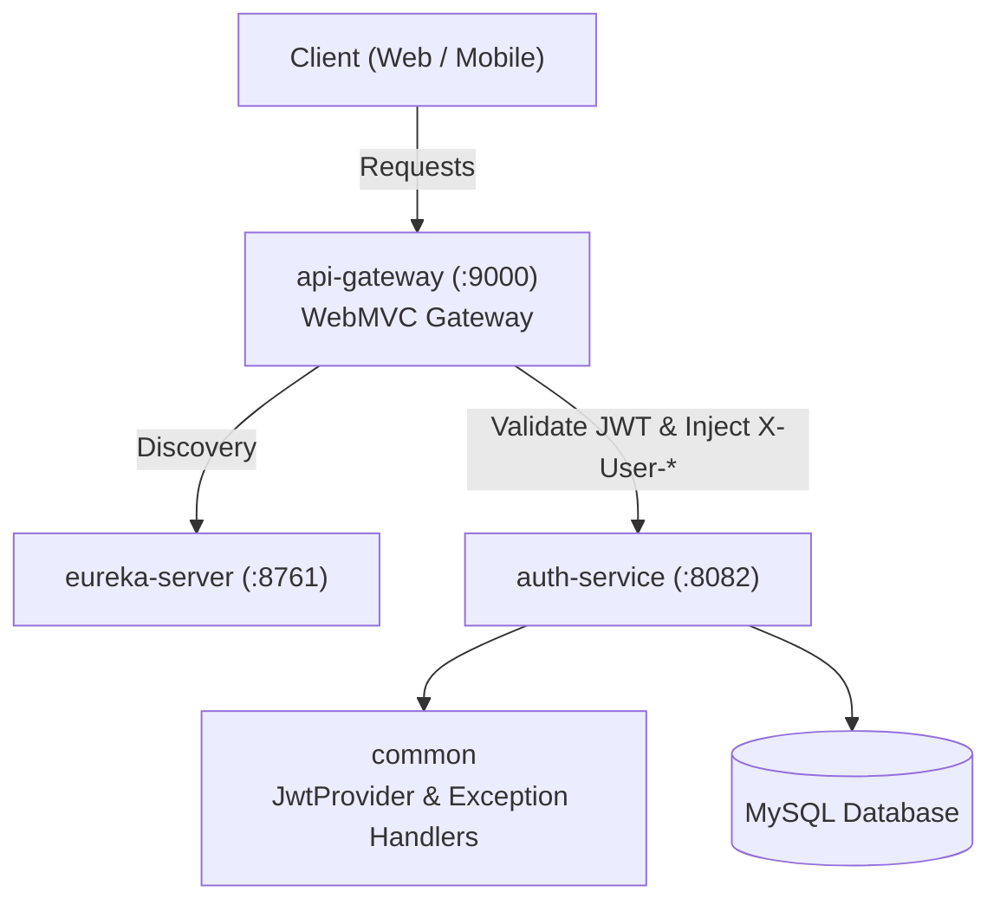
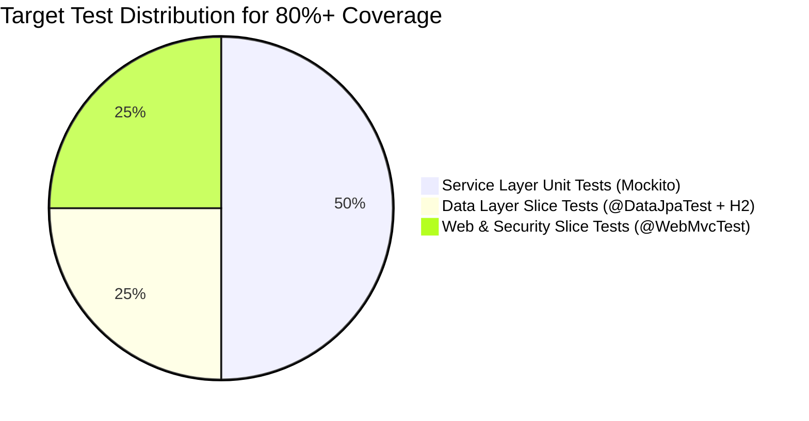
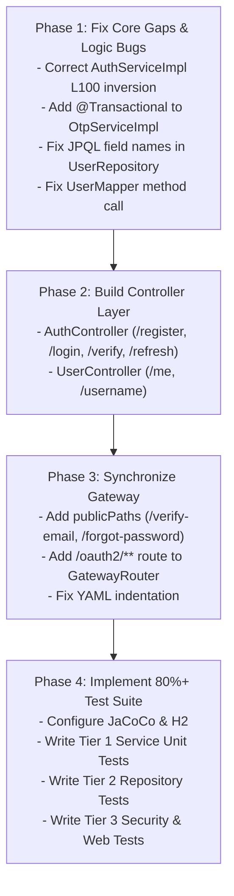

# PayFlow Backend: Gap Analysis & 80%+ Test Coverage Blueprint
**Module Scope:** Entire Workspace (`auth-service`, `api-gateway`, `common`, `eureka-server`)  
**Generated Date:** 2026-10-03  
**Status:** Architecture Audit & Quality Assurance Roadmap  

---

## 1. Executive Summary & Scan Scope

A comprehensive static analysis and architectural audit was performed across all modules of the PayFlow distributed backend. This document captures:
1. **Current Working Foundation**: Components implemented cleanly and following industry standards.
2. **Critical Gaps & Bugs Catalog**: 12 specific bugs, logic inversions, configuration misalignments, and architectural gaps discovered with exact line numbers and code-level remediation.
3. **80%+ Code Coverage Test Suite Blueprint**: Step-by-step test matrix spanning Unit (Mockito), Data Layer Slice (`@DataJpaTest` + H2), and Web Layer (`@WebMvcTest`).



---

## 2. Current Implementation State: What Is Done & Working

### 2.1 `auth-service`
- **Domain Entities & JPA Repositories**:
  - `User`, `UserCredentials`, `RefreshToken`, `OtpCode`, `OAuthAccount` are structured with clean JPA annotations, indexes, and audit timestamps.
- **Refresh Token Rotation (RTR)**:
  - `TokenServiceImpl`: Robust implementation of single-use refresh token rotation, cryptographically secure token generation (`Base64Url`), SHA-256 token hashing in MySQL, and family revocation upon reuse detection (theft protection).
- **OTP Generation & Verification**:
  - `OtpServiceImpl`: 6-digit random code generation, SHA-256 hashing, 5-attempt brute-force threshold, automatic invalidation of prior pending codes, and scheduled cleanup.
- **Username Lifecycle & Cooldown**:
  - `UserNameServiceImpl`: Enforces the 45-day cooldown constraint between handle updates and verifies uniqueness.
  - `UsernameReminderScheduler`: Scheduled cron task scanning users with auto-generated handles to trigger email reminders.
- **Email Notification Facade**:
  - `EmailServiceImpl`: Event-driven structure logging styled terminal cards, designed for clean migration to Kafka / `@Async`.

### 2.2 `common`
- **JWT Provider Engine**:
  - `JwtProvider`: High-performance JJWT 0.12.6 implementation supporting HS256 HMAC-SHA, claims packaging, parsing, and expiration validation.
- **Standardized DTO Contracts**:
  - `ApiResponse<T>`, `ErrorResponse`, `ValidationErrorResponse`.
- **Global Error Handling**:
  - `GlobalExceptionHandler`: Centralized `@RestControllerAdvice` mapping domain exceptions (`BaseException`), bean validation errors, and access denied events into RFC-compliant payloads.

### 2.3 `api-gateway`
- **Security & Token Propagation**:
  - `JwtAuthenticationFilter`: Extracts Bearer token, validates against `JwtProvider`, establishes `SecurityContext`, and wraps the request using `HeaderInjectingRequestWrapper` to pass trusted `X-User-Id`, `X-User-Email`, and `X-User-Roles` headers downstream while stripping malicious spoofed client headers.

---

## 3. Comprehensive Bug & Gap Catalog

### 🚨 Gap 1: Empty Controller Layer in `auth-service`
- **Location:** `auth-service/src/main/java/com/payflow/authservice/controller`
- **Severity:** High (Endpoints completely unexposed)
- **Problem:** The `controller` package is completely empty. `AuthService`, `UserService`, and `UserNameService` have no REST controllers exposing them over HTTP.
- **Remediation:** Create `AuthController` (`/api/v1/auth/**`) and `UserController` (`/api/v1/users/**`).

---

### 🚨 Gap 2: Logic Inversion Bug in Temporary Username Email
- **Location:** `auth-service/src/main/java/com/payflow/authservice/service/impl/AuthServiceImpl.java#L100`
- **Severity:** High (Functional bug)
- **Problem:**
  ```java
  // Line 100 in AuthServiceImpl.java:
  if (!isAutoGenerated) {
      emailService.sendTemporaryUsernameEmail(registerRequest.getEmail(), userName);
  }
  ```
  When a user supplies their own custom username (`isAutoGenerated == false`), this condition evaluates to `true` and sends them an email stating *"Temporary username assigned"*.
- **Fix:** Invert condition to:
  ```java
  if (isAutoGenerated) {
      emailService.sendTemporaryUsernameEmail(registerRequest.getEmail(), userName);
  }
  ```

---

### 🚨 Gap 3: Missing `@Transactional` on `@Modifying` Repository Queries
- **Location:** `auth-service/src/main/java/com/payflow/authservice/service/impl/OtpServiceImpl.java#L44`
- **Severity:** High (Runtime crash)
- **Problem:**
  `generateAndSend` calls `otpCodeRepository.invalidateAll(email, purpose)`, which is an `@Modifying` query:
  ```java
  @Override
  public void generateAndSend(String email, OtpPurpose purpose) {
      otpCodeRepository.invalidateAll(email, purpose); // Throws TransactionRequiredException!
  ```
  In Spring Data JPA, executing an `@Modifying` query without an active transaction throws:
  `jakarta.persistence.TransactionRequiredException: Executing an update/delete query`.
- **Fix:** Annotate `generateAndSend` and `verifyOtp` with `@Transactional`.

---

### 🚨 Gap 4: JPQL Entity Property Name Mismatches in `UserRepository`
- **Location:** `auth-service/src/main/java/com/payflow/authservice/repository/UserRepository.java#L37-L40`
- **Severity:** High (Runtime crash when scheduler runs)
- **Problem:**
  ```sql
  SELECT u FROM User u
  WHERE u.usernameChangedAt IS NULL
    AND u.userStatus = 'ACTIVE'
    AND u.createdAt < :createdBefore
    AND (u.lastUsernameReminderAt IS NULL OR u.lastUsernameReminderAt < :reminderCutoff)
    AND u.usernameReminderCount < :maxReminders
  ```
  In Java entity `User.java`, the field names are:
  - `private Instant userNameChangedAt;` (Capital `N`)
  - `private Instant lastUserNameReminderAt;` (Capital `N`)
  JPQL operates on Java entity field names, NOT database column names. This will throw:
  `QueryException: could not resolve property: usernameChangedAt of: com.payflow.authservice.model.entity.User`.
- **Fix:** Change `u.usernameChangedAt` to `u.userNameChangedAt` and `u.lastUsernameReminderAt` to `u.lastUserNameReminderAt`.

---

### 🚨 Gap 5: Method Name Mismatch in MapStruct `UserMapper`
- **Location:** `auth-service/src/main/java/com/payflow/authservice/mapper/UserMapper.java#L18`
- **Severity:** High (Compilation error)
- **Problem:**
  ```java
  @Mapping(target = "isUsernameTemporary", expression = "java(user.getUsernameChangedAt() == null)")
  ```
  Because the entity property is `userNameChangedAt`, Lombok generates `getUserNameChangedAt()` (capital `N`). Calling `user.getUsernameChangedAt()` will fail compilation.
- **Fix:** Change expression to `java(user.getUserNameChangedAt() == null)`.

---

### 🚨 Gap 6: API Gateway Public Endpoints Misaligned
- **Location:** `api-gateway/src/main/java/com/payflow/apigateway/config/publicPathConfig.java#L17-L27`
- **Severity:** High (Gateway blocks unauthenticated operations)
- **Problem:**
  `publicPaths()` in the API Gateway currently lists:
  ```java
  return List.of(
      "/api/v1/auth/register",
      "/api/v1/auth/login",
      "/api/v1/auth/refresh-token", // BUG: auth-service uses /refresh, not /refresh-token
      "/api/v1/auth/oauth2/**",
      "/login/oauth2/**",
      "/actuator/health",
      "/actuator/info",
      "/actuator/gateway/**"
  );
  ```
  **Missing paths:**
  - `/api/v1/auth/verify-email`
  - `/api/v1/auth/resend-otp`
  - `/api/v1/auth/forgot-password`
  - `/api/v1/auth/reset-password`
  Any public user calling `/verify-email` or `/forgot-password` via the Gateway gets blocked with `401 Unauthorized`.
- **Fix:** Update `publicPaths()` to match all unauthenticated endpoints and sync `/refresh`.

---

### 🚨 Gap 7: API Gateway Route Configuration Missing OAuth Paths
- **Location:** `api-gateway/src/main/java/com/payflow/apigateway/config/GateWayRouteConfig.java#L23`
- **Severity:** Medium (OAuth login routes fail at Gateway)
- **Problem:**
  ```java
  request -> request.path().startsWith("/api/v1/auth/"),
  ```
  The gateway router only forwards requests starting with `/api/v1/auth/`. External OAuth2 initiation (`/oauth2/**`) and provider callback (`/login/oauth2/**`) are rejected at the gateway.
- **Fix:** Expand router predicate to include `/oauth2/**` and `/login/oauth2/**`.

---

### 🚨 Gap 8: YAML Indentation Error in `api-gateway/application.yaml`
- **Location:** `api-gateway/src/main/resources/application.yaml#L9-L13`
- **Severity:** Medium (Gateway discovery settings ignored)
- **Problem:**
  ```yaml
  server:
    port: ${PORT:9000}

    cloud: # INDENTED UNDER server:!
      gateway:
        discovery:
          locator:
            enabled: false
  ```
  Spring interprets this as `server.cloud.gateway...` instead of `spring.cloud.gateway...`.
- **Fix:** Shift `cloud:` out from under `server:` and place it under `spring:`.

---

### 🚨 Gap 9: Unwired `JwtAuthenticationEntryPoint` in `CustomSecurityConfig`
- **Location:** `auth-service/src/main/java/com/payflow/authservice/security/config/CustomSecurityConfig.java#L45-L56`
- **Severity:** Medium (Inconsistent error response format)
- **Problem:**
  `JwtAuthenticationEntryPoint` is defined as a Spring Bean to return standard JSON 401 errors, but is never registered in the `SecurityFilterChain`:
  ```java
  http.exceptionHandling(ex -> ex.authenticationEntryPoint(jwtAuthenticationEntryPoint))
  ```
  Without this, unauthorized calls fall back to default HTML/raw 403/401 handling.
- **Fix:** Inject `JwtAuthenticationEntryPoint` into `CustomSecurityConfig` and attach it to `exceptionHandling`.

---

### 🚨 Gap 10: JWT Config Property Key Inconsistency Across Modules
- **Location:** `auth-service` vs `api-gateway` `JwtConfig.java`
- **Severity:** Low (Configuration confusion)
- **Problem:**
  - `auth-service` reads `@Value("${app.jwt.secret}")` and `@Value("${app.jwt.expiration-millis}")`.
  - `api-gateway` reads `@Value("${JWT_SECRET:...}")` and `@Value("${JWT_EXPIRATION_MILLIS:...}")`.
- **Fix:** Unify both modules to read `app.jwt.secret` with fallback to `JWT_SECRET`.

---

### 🚨 Gap 11: Database URL Typo in `auth-service/application.yaml`
- **Location:** `auth-service/src/main/resources/application.yaml#L6`
- **Severity:** Low (Schema naming hygiene)
- **Problem:**
  `url: ${SPRING_DATASOURCE_URL:jdbc:mysql://localhost:3306/secuirty...}`
  Schema name is spelled `secuirty`.
- **Fix:** Correct to `payflow_auth` or `security`.

---

### 🚨 Gap 12: Documentation File Inside Java Source Tree
- **Location:** `auth-service/src/main/java/com/payflow/authservice/extra/AUTH_SERVICE_LLD.md`
- **Severity:** Low (Source hygiene)
- **Problem:** Markdown documentation is located inside `src/main/java/`, getting packaged into production JARs.
- **Fix:** Move to root `extra/` or delete the duplicate since `extra/AUTH_SERVICE_LLD.md` already exists.

---

## 4. Complete Blueprint For >= 80% Test Coverage



### 4.1 Maven Dependencies & JaCoCo Setup

#### 1. Add JaCoCo to Root `pom.xml`:
```xml
<plugin>
    <groupId>org.jacoco</groupId>
    <artifactId>jacoco-maven-plugin</artifactId>
    <version>0.8.12</version>
    <executions>
        <execution>
            <goals><goal>prepare-agent</goal></goals>
        </execution>
        <execution>
            <id>report</id>
            <phase>test</phase>
            <goals><goal>report</goal></goals>
        </execution>
        <execution>
            <id>check</id>
            <goals><goal>check</goal></goals>
            <configuration>
                <rules>
                    <rule>
                        <element>BUNDLE</element>
                        <limits>
                            <limit>
                                <counter>LINE</counter>
                                <value>COVEREDRATIO</value>
                                <minimum>0.80</minimum>
                            </limit>
                        </limits>
                    </rule>
                </rules>
            </configuration>
        </execution>
    </executions>
</plugin>
```

#### 2. Add Test Scope Dependencies to `auth-service/pom.xml` and `common/pom.xml`:
```xml
<!-- In auth-service/pom.xml & common/pom.xml -->
<dependency>
    <groupId>org.springframework.boot</groupId>
    <artifactId>spring-boot-starter-test</artifactId>
    <scope>test</scope>
</dependency>
<dependency>
    <groupId>com.h2database</groupId>
    <artifactId>h2</artifactId>
    <scope>test</scope>
</dependency>
```

---

### 4.2 Tier 1: Service Unit Tests (Pure Mockito) — *Target: 50% Coverage*
Directory: `auth-service/src/test/java/com/payflow/authservice/service/`

#### 1. `AuthServiceImplTest`
- `registerUser_Success_WithProvidedUsername()`:
  - Mock: `userRepository.existsByUserName() -> false`, `existsByEmail() -> false`.
  - Assert: `userRepository.save()` called with `ACTIVE=PENDING_VERIFICATION`, OTP generated, password encoded.
- `registerUser_Success_WithAutoGeneratedUsername()`:
  - Input: blank username.
  - Assert: `userNameGenerator.generateFromEmail()` invoked, `userNameChangedAt == null`.
- `registerUser_ThrowsPasswordMismatchException()`:
  - Input: `password != confirmPassword`.
- `registerUser_ThrowsUserNameAlreadyTakenException()`:
  - Mock: `userRepository.existsByUserName() -> true`.
- `registerUser_ThrowsEmailAlreadyRegisteredException()`:
  - Mock: `userRepository.existsByEmail() -> true`.
- `verifyEmail_Success()`:
  - Assert: `emailVerified = true`, `userStatus = ACTIVE`, welcome email sent.
- `verifyEmail_ThrowsInvalidOtpException()`:
  - Mock: `otpService.verifyOtp()` throws `InvalidOtpException`.
- `login_Success_ResetsFailedAttempts()`:
  - Mock: `authenticationManager.authenticate() -> successful auth`.
  - Assert: `failedAttempts` reset to 0, `lockedUntil = null`, `tokenService.issueTokens()` returned.
- `login_ThrowsBadCredentials_IncrementsFailedAttempts()`:
  - Mock: `authenticate()` throws `BadCredentialsException`.
  - Assert: `user.failedAttempts` incremented by 1.
- `login_LocksAccount_After5FailedAttempts()`:
  - Mock: User already has 4 attempts, bad credentials provided.
  - Assert: `failedAttempts = 5`, `lockedUntil` set to `now + 24 hours`.
- `login_ThrowsLockedException_WhenAccountLocked()`:
  - Mock: `authenticate()` throws `LockedException`.
  - Assert: Throws `BusinessException` with error code `ACCOUNT_LOCKED`.
- `login_ThrowsDisabledException_WhenEmailUnverified()`:
  - Mock: `authenticate()` throws `DisabledException`.
  - Assert: Throws `BusinessException` with `EMAIL_NOT_VERIFIED`.
- `changePassword_Success()` & `changePassword_ThrowsOnCurrentPasswordMismatch()`
- `forgotPassword_GeneratesOtpOnlyWhenUserExists()`
- `resetPassword_Success_UpdatesCredentialAndUnlocksUser()`

#### 2. `TokenServiceImplTest`
- `issueTokens_CreatesNewTokenPairAndHashesRefreshToken()`:
  - Assert: Raw refresh token returned to client, SHA-256 hash stored in DB, `familyId` generated.
- `refreshTokens_RotatesRefreshTokenSuccessfully()`:
  - Mock: Valid active `RefreshToken` in DB.
  - Assert: Old token marked `revoked = true`, reason `ROTATED`, new token generated with same `familyId`.
- `refreshTokens_TheftDetected_RevokesEntireFamily()`:
  - Mock: Database token has `revoked == true`.
  - Assert: `revokeFamily` invoked, warning logged, `InvalidCredentialsException` thrown.
- `refreshTokens_ExpiredToken_ThrowsInvalidCredentials()`:
  - Mock: `expiresAt.isBefore(now)`.
  - Assert: Token marked `revoked = true`, reason `EXPIRED`.
- `revokeAllForUser_Success()`:
  - Assert: `refreshTokenRepository.revokeAllForUser` called.

#### 3. `OtpServiceImplTest`
- `generateAndSend_InvalidatesPriorOtpsAndPublishesEvent()`:
  - Assert: `otpCodeRepository.invalidateAll()` called before `save()`, `OtpRequestedEvent` published.
- `verifyOtp_Success_MarksConsumed()`:
  - Mock: Valid hash match.
  - Assert: `otpCode.setConsumed(true)` saved.
- `verifyOtp_Mismatch_IncrementsAttempts()`:
  - Assert: `attempts` incremented, `InvalidOtpException` thrown.
- `verifyOtp_ExceedsMaxAttempts_ConsumesAndRejects()`:
  - Mock: `attempts == 5`.
  - Assert: `consumed = true`, rejected.
- `cleanupExpired_DeletesOldRecords()`

#### 4. `UserNameServiceImplTest`
- `updateUsername_FirstTime_AllowsImmediateUpdate()`:
  - Mock: `user.getUserNameChangedAt() == null`.
  - Assert: Update allowed, `userNameChangedAt` set to now, next change allowed at `now + 45 days`.
- `updateUsername_Within45Days_ThrowsUserNameCoolDownException()`:
  - Mock: `user.getUserNameChangedAt() == now - 10 days`.
  - Assert: Throws `UserNameCoolDownException`.
- `updateUsername_After45Days_Success()`:
  - Mock: `user.getUserNameChangedAt() == now - 46 days`.
  - Assert: Username updated successfully.
- `updateUsername_SameUsername_ThrowsException()`
- `updateUsername_TakenByAnotherUser_ThrowsException()`

#### 5. `UsernameReminderSchedulerTest`
- `sendUsernameReminders_SendsEmailAndIncrementsCount()`:
  - Mock: 2 users needing reminder returned from repo.
  - Assert: Email sent for both, `userNameReminderCount` incremented to 1, `lastUserNameReminderAt` updated.
- `sendUsernameReminders_CatchesAndContinuesOnIndividualFailure()`

---

### 4.3 Tier 2: Repository Slice Tests (`@DataJpaTest` + H2) — *Target: 20% Coverage*
Directory: `auth-service/src/test/java/com/payflow/authservice/repository/`

#### 1. `UserRepositoryTest`
- Test `findByUsernameOrEmail`: Verify it matches on either email or username correctly.
- Test `findUsersNeedingUsernameReminder`: Seed users with varying `userNameChangedAt`, `createdAt`, `userStatus`, and `reminderCount`. Verify only matching candidates are returned.

#### 2. `RefreshTokenRepositoryTest`
- Test `revokeFamily`: Seed 3 tokens with `familyId = "fam-1"` and 1 with `"fam-2"`. Call `revokeFamily("fam-1", "THEFT")`. Verify only tokens of `fam-1` are marked `revoked = true`.
- Test `revokeAllForUser`: Verify all active tokens for a specific `userId` are revoked.

#### 3. `OtpCodeRepositoryTest`
- Test `findLatestValid`: Verify it ignores consumed and expired OTPs.
- Test `invalidateAll`: Verify it marks all unconsumed OTPs for a given email and purpose as consumed.

---

### 4.4 Tier 3: Security & Controller Slice Tests (`@WebMvcTest`) — *Target: 20% Coverage*

#### 1. `JwtProviderTest` (in `common` module)
- `generateToken_ParsesValidClaimsSuccessfully()`:
  - Verify userId, email, and roles match original inputs.
- `parseToken_ExpiredToken_ThrowsExpiredJwtException()`:
  - Generate token with negative expiration; assert exception thrown.
- `parseToken_TamperedSignature_ThrowsSignatureException()`:
  - Mutate token payload; assert signature validation fails.

#### 2. `JwtAuthFilterTest` (in `auth-service`)
- `validBearerToken_PopulatesSecurityContext()`:
  - Pass valid Bearer header; assert `SecurityContextHolder.getContext().getAuthentication()` is populated with correct user and `ROLE_CUSTOMER`.
- `missingHeader_ContinuesFilterChainWithoutAuthentication()`
- `expiredToken_ClearsSecurityContextAndContinues()`

#### 3. `AuthControllerTest` (once Controller layer is added)
- Verify HTTP 400 with `ValidationErrorResponse` when `@Valid` fails on `RegisterRequest` (e.g., invalid email, blank password).
- Verify HTTP 200 with `TokenResponse` on `/login`.
- Verify HTTP 401 when invalid credentials supplied.

---

## 5. Phased Action Roadmap


