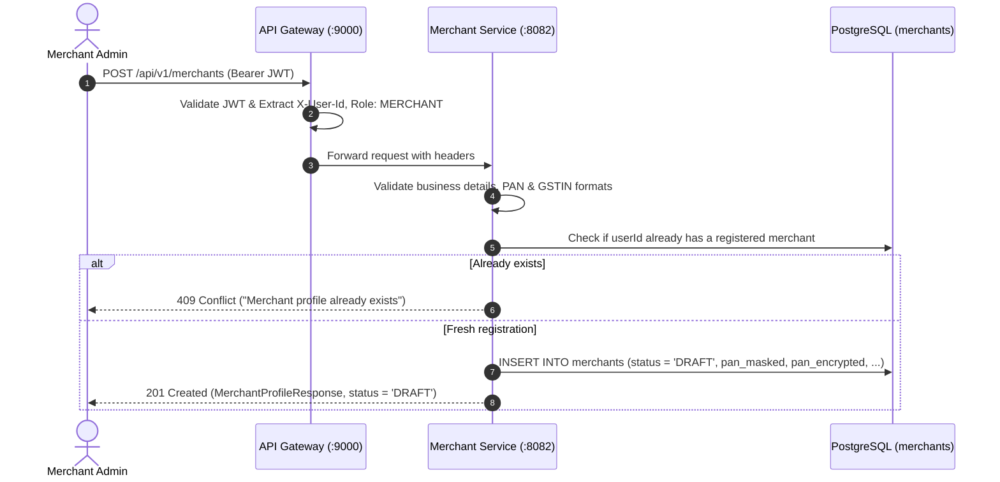
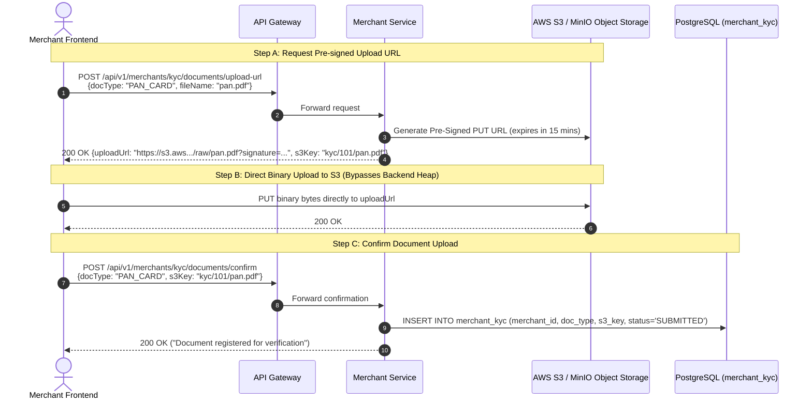
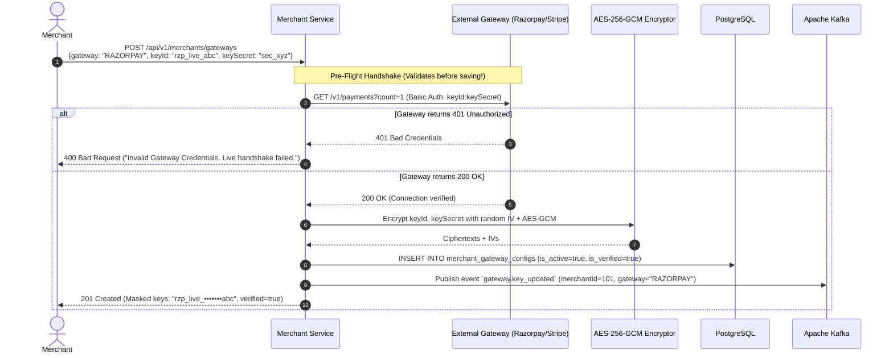
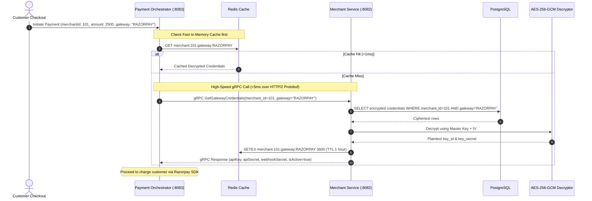

# PayFlow — Merchant & Config Service: Comprehensive Research, Flows & Architecture

---

## 1. Executive Summary & Core Purpose

In PayFlow’s event-driven payment ecosystem, the **Merchant & Config Service** (`merchant-service`) serves as the **master business registry, compliance boundary, and gateway credential vault**.

### Why does this service exist?
1. **Decoupling Business Logic from Checkout**: Business onboarding, KYC verifications, bank account approvals, and document audits are slow, administrative workflows. If they lived inside the payment processing service, slow document uploads or third-party KYC timeouts would directly degrade customer checkout speed.
2. **The "Zero-Fund Holding" Regulatory Moat**:
   - In traditional payment gateways, the gateway collects customer money into an escrow account and disburses payouts to merchants. In India, this requires a strict, multi-year **RBI Payment Aggregator (PA) license** with heavy capital requirements.
   - PayFlow solves this by letting merchants configure their **own** Razorpay, Stripe, or PayPal API keys. When a customer pays, PayFlow routes the transaction straight into the merchant’s own gateway account. PayFlow orchestrates the payment but never holds the funds. **Merchant Service is the vault that secures and manages these credentials.**

---

## 2. Main Tasks & Core Responsibilities

```
                                  ┌────────────────────────────────────────┐
                                  │      MERCHANT & CONFIG SERVICE         │
                                  └───────────────────┬────────────────────┘
                                                      │
         ┌─────────────────────┬──────────────────────┼──────────────────────┬──────────────────────┐
         ▼                     ▼                      ▼                      ▼                      ▼
  1. Business Profile    2. KYC Compliance      3. Gateway Key Vault   4. gRPC Key Supplier   5. Kafka Event Bus
  - Legal business info  - State machine         - AES-256-GCM crypto   - <5ms binary RPC      - merchant.verified
  - PAN / GSTIN capture  - S3 Pre-signed URLs   - Live API handshake   - Redis cached         - kyc.verified
  - Links to auth userId - PII masking          - Razorpay/Stripe keys - Critical path only    - kyc.rejected
```

### Task 1: Merchant Business Onboarding
- Links the business profile to the authenticated user from `auth-service` via `userId`.
- Captures business metadata: Legal Business Name, Brand/Trade Name, Business Type (`INDIVIDUAL`, `PROPRIETORSHIP`, `PRIVATE_LIMITED`, `PUBLIC_LIMITED`), Business Category, Registered Address, Support Email, and Support Phone.

### Task 2: KYC & Compliance Verification State Machine
- Manages an explicit, auditable verification lifecycle:
  $$\text{DRAFT} \longrightarrow \text{SUBMITTED} \longrightarrow \text{IN\_REVIEW} \longrightarrow \text{VERIFIED} \text{ / } \text{REJECTED}$$
- Pluggable verification engine:
  - **Local/Dev**: Automatic mock verification.
  - **Production**: Integration with licensed KYC providers (Digio, Setu, Karza, Surepass).
- Supports re-submission upon rejection with explicit feedback reasons.

### Task 3: Zero-Heap Document Management (Pre-Signed S3 URLs)
- Merchants must upload business proofs (PAN Card, Certificate of Incorporation, Cancelled Cheque).
- Instead of streaming large image/PDF files through the Spring Boot application (which exhausts JVM heap memory), Merchant Service issues **time-limited S3/MinIO pre-signed upload URLs**.
- The client uploads directly to S3. The backend stores only the resulting S3 object key.

### Task 4: Gateway Key Vault & Live Pre-Flight Handshake
- Stores credentials for multi-gateway routing:
  - **Razorpay**: `key_id`, `key_secret`
  - **Stripe**: `publishable_key`, `secret_key`, `webhook_secret`
  - **PayPal**: `client_id`, `client_secret`
- **Envelope Encryption**: Keys are encrypted at rest in PostgreSQL using AES-256-GCM with dynamic Initialization Vectors (IV).
- **Live Sandbox Pre-Flight Handshake**: Before saving or activating a key, Merchant Service makes a live test API call to Razorpay/Stripe. If the gateway returns HTTP 401 (invalid key/typo), the update is rejected immediately.

### Task 5: Ultra-Low Latency gRPC Supplier for Payment Orchestrator
- During checkout, `payment-orchestrator` needs the merchant’s decrypted gateway key to charge the customer.
- Instead of slow REST calls (HTTP/1.1 + JSON), this dependency is served exclusively over **gRPC (HTTP/2 + binary Protobuf)** with local Redis caching, guaranteeing sub-5ms response times.

### Task 6: Kafka Domain Event Publishing
- Emits events to the platform message bus:
  - `merchant.verified`: Triggered when KYC passes; notifies Notification Service to send merchant welcome pack.
  - `kyc.submitted` / `kyc.rejected`: Updates admin dashboard and triggers alert emails.
  - `gateway.key_updated`: Invalidates stale cached credentials in `payment-orchestrator`.

---

## 3. End-to-End Request Flows

### Flow 1: Merchant Registration & Profile Creation


---

### Flow 2: Zero-Heap KYC Document Upload (Pre-Signed S3 URLs)


---

### Flow 3: Gateway Key Onboarding with Live Pre-Flight Handshake


---

### Flow 4: Synchronous gRPC Key Retrieval during Checkout (The Critical Path)


---

## 4. Engineering Challenges & Solutions in Merchant Service

| # | Challenge | Impact if Ignored | How PayFlow Solves It |
| :--- | :--- | :--- | :--- |
| **1** | **Gateway Secrets Stored in Plaintext** | A DB leak exposes every merchant's live Stripe/Razorpay keys, leading to total financial compromise. | **JPA AttributeConverter + AES-256-GCM**: Column-level encryption. Every secret is encrypted with a unique random IV before SQL `INSERT`/`UPDATE` and decrypted on `SELECT`. Master key loaded from environment / AWS Secrets Manager. |
| **2** | **Critical Checkout Path Dependency** | Payment Orchestrator needs merchant keys on *every* payment. If Merchant Service is slow, checkout crashes. | **gRPC + Redis Caching**: Binary Protobuf serialization over multiplexed HTTP/2 (<5ms latency). Decrypted credentials cached in Redis with automatic eviction upon key rotation. |
| **3** | **JVM Heap Exhaustion from File Uploads** | Large 10MB KYC PDFs uploaded concurrently cause GC pauses and out-of-memory errors. | **S3 Pre-Signed URLs**: The backend never handles document byte streams. Browsers upload directly to S3 via pre-signed `PUT` URLs; the DB only stores the S3 URI. |
| **4** | **Typo in API Key Breaks Checkout** | Merchant pastes a broken key $\rightarrow$ 100% of customer transactions immediately fail. | **Live Pre-Flight Sandbox Handshake**: Before saving credentials, the service makes an authenticated ping to the live gateway provider. Rejects invalid keys immediately. |
| **5** | **Sensitive PII Compliance (PAN/Aadhaar/Bank)** | Storing raw Aadhaar or full bank account numbers violates RBI & UIDAI data protection rules. | **Masking & Tokenization**: Never store full Aadhaar (store verification token + last 4 digits). Bank account numbers are AES-encrypted, exposing only `last4` for UI display. |
| **6** | **Flaky Third-Party KYC Verification APIs** | Government and verification vendor APIs take 5–15 seconds or randomly timeout. | **Asynchronous KYC Processing**: Non-blocking state machine. Submission returns immediately with `status=SUBMITTED`; background processing transitions to `VERIFIED` and publishes Kafka events. |

---

## 5. PostgreSQL Database Schema Design

```sql
-- 1. Merchants Table
CREATE TABLE merchants (
    id BIGSERIAL PRIMARY KEY,
    user_id BIGINT NOT NULL UNIQUE, -- Foreign reference to auth-service users.id
    business_name VARCHAR(150) NOT NULL,
    brand_name VARCHAR(100),
    business_type VARCHAR(50) NOT NULL, -- INDIVIDUAL, PROPRIETORSHIP, PRIVATE_LIMITED, etc.
    business_category VARCHAR(100) NOT NULL,
    pan_number_masked VARCHAR(20) NOT NULL,
    pan_number_encrypted TEXT NOT NULL,
    gstin VARCHAR(30),
    status VARCHAR(30) NOT NULL DEFAULT 'DRAFT', -- DRAFT, SUBMITTED, IN_REVIEW, VERIFIED, SUSPENDED
    support_email VARCHAR(255) NOT NULL,
    support_phone VARCHAR(20),
    created_at TIMESTAMP WITH TIME ZONE NOT NULL DEFAULT NOW(),
    updated_at TIMESTAMP WITH TIME ZONE NOT NULL DEFAULT NOW()
);

CREATE INDEX idx_merchants_user_id ON merchants(user_id);
CREATE INDEX idx_merchants_status ON merchants(status);

-- 2. Merchant KYC Documents
CREATE TABLE merchant_kyc (
    id BIGSERIAL PRIMARY KEY,
    merchant_id BIGINT NOT NULL REFERENCES merchants(id) ON DELETE CASCADE,
    document_type VARCHAR(50) NOT NULL, -- PAN_CARD, GST_CERTIFICATE, CANCELLED_CHEQUE, AADHAAR_FRONT
    s3_object_key VARCHAR(500) NOT NULL,
    verification_reference_id VARCHAR(100),
    status VARCHAR(30) NOT NULL DEFAULT 'PENDING', -- PENDING, SUBMITTED, VERIFIED, REJECTED
    rejection_reason TEXT,
    verified_at TIMESTAMP WITH TIME ZONE,
    created_at TIMESTAMP WITH TIME ZONE NOT NULL DEFAULT NOW()
);

CREATE INDEX idx_kyc_merchant_id ON merchant_kyc(merchant_id);

-- 3. Merchant Bank Accounts (For Settlement & Payouts)
CREATE TABLE merchant_bank_accounts (
    id BIGSERIAL PRIMARY KEY,
    merchant_id BIGINT NOT NULL REFERENCES merchants(id) ON DELETE CASCADE,
    account_number_encrypted TEXT NOT NULL,
    account_number_last4 VARCHAR(4) NOT NULL,
    ifsc_code VARCHAR(20) NOT NULL,
    bank_name VARCHAR(100) NOT NULL,
    beneficiary_name VARCHAR(150) NOT NULL,
    is_primary BOOLEAN NOT NULL DEFAULT TRUE,
    is_verified BOOLEAN NOT NULL DEFAULT FALSE,
    created_at TIMESTAMP WITH TIME ZONE NOT NULL DEFAULT NOW(),
    updated_at TIMESTAMP WITH TIME ZONE NOT NULL DEFAULT NOW()
);

CREATE INDEX idx_bank_merchant_id ON merchant_bank_accounts(merchant_id);

-- 4. Merchant Gateway Configurations (The Encrypted Vault)
CREATE TABLE merchant_gateway_configs (
    id BIGSERIAL PRIMARY KEY,
    merchant_id BIGINT NOT NULL REFERENCES merchants(id) ON DELETE CASCADE,
    gateway_type VARCHAR(30) NOT NULL, -- RAZORPAY, STRIPE, PAYPAL
    api_key_encrypted TEXT NOT NULL,
    api_secret_encrypted TEXT NOT NULL,
    webhook_secret_encrypted TEXT,
    is_active BOOLEAN NOT NULL DEFAULT TRUE,
    is_test_mode BOOLEAN NOT NULL DEFAULT TRUE,
    verified_at TIMESTAMP WITH TIME ZONE NOT NULL DEFAULT NOW(),
    created_at TIMESTAMP WITH TIME ZONE NOT NULL DEFAULT NOW(),
    updated_at TIMESTAMP WITH TIME ZONE NOT NULL DEFAULT NOW(),
    CONSTRAINT uq_merchant_gateway UNIQUE(merchant_id, gateway_type)
);

CREATE INDEX idx_gateway_merchant_active ON merchant_gateway_configs(merchant_id, is_active);
```

---

## 6. Communication Protocols & API Specifications

### 6.1 REST Endpoints (For Merchant Portal & Dashboard)
All endpoints pass through **API Gateway (`:9000`)** with Bearer JWT:
- `POST /api/v1/merchants` $\rightarrow$ Create onboarding profile
- `GET  /api/v1/merchants/me` $\rightarrow$ Get my business profile & KYC status
- `PUT  /api/v1/merchants/me` $\rightarrow$ Update business contact details
- `POST /api/v1/merchants/kyc/documents/upload-url` $\rightarrow$ Request pre-signed S3 upload URL
- `POST /api/v1/merchants/kyc/documents/confirm` $\rightarrow$ Confirm uploaded S3 object key
- `POST /api/v1/merchants/kyc/submit` $\rightarrow$ Trigger verification state transition
- `POST /api/v1/merchants/gateways` $\rightarrow$ Add/update Razorpay/Stripe keys (with live pre-flight check)
- `GET  /api/v1/merchants/gateways` $\rightarrow$ List configured gateways (with masked keys)
- `POST /api/v1/merchants/bank-accounts` $\rightarrow$ Add settlement payout bank account

---

### 6.2 gRPC Contract (`merchant_service.proto`)
Used by `payment-orchestrator` during checkout:

```protobuf
syntax = "proto3";

package com.payflow.merchant.grpc;

option java_multiple_files = true;
option java_package = "com.payflow.merchant.grpc";

service MerchantGrpcService {
    // Fetches live decrypted gateway credentials for checkout
    rpc GetGatewayCredentials (GetGatewayCredentialsRequest) returns (GetGatewayCredentialsResponse);

    // Validates whether the merchant is KYC-approved and active
    rpc ValidateMerchantStatus (ValidateMerchantStatusRequest) returns (ValidateMerchantStatusResponse);
}

message GetGatewayCredentialsRequest {
    int64 merchant_id = 1;
    string gateway_type = 2; // "RAZORPAY", "STRIPE", "PAYPAL"
}

message GetGatewayCredentialsResponse {
    int64 merchant_id = 1;
    string gateway_type = 2;
    string api_key = 3;
    string api_secret = 4;
    string webhook_secret = 5;
    bool is_test_mode = 6;
    bool is_active = 7;
}

message ValidateMerchantStatusRequest {
    int64 merchant_id = 1;
}

message ValidateMerchantStatusResponse {
    int64 merchant_id = 1;
    bool is_verified = 2;
    string status = 3; // "VERIFIED", "PENDING_KYC", "SUSPENDED"
}
```

---

### 6.3 Kafka Topics & Event Schemas
- **`merchant.verified`**:
  ```json
  {
    "eventId": "evt_8921389",
    "eventType": "MERCHANT_VERIFIED",
    "merchantId": 101,
    "userId": 42,
    "businessName": "Acme Payments Pvt Ltd",
    "timestamp": "2026-10-05T14:30:00Z"
  }
  ```
- **`kyc.status_changed`**:
  ```json
  {
    "eventId": "evt_8921390",
    "merchantId": 101,
    "previousStatus": "SUBMITTED",
    "currentStatus": "VERIFIED",
    "reason": null,
    "timestamp": "2026-10-05T14:32:00Z"
  }
  ```
