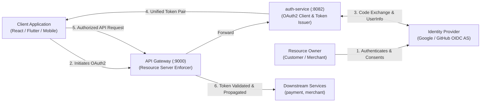
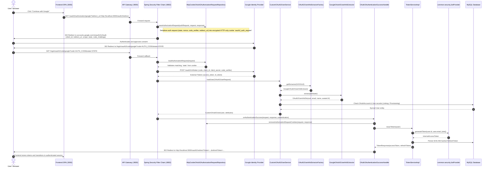
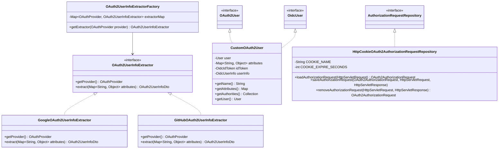
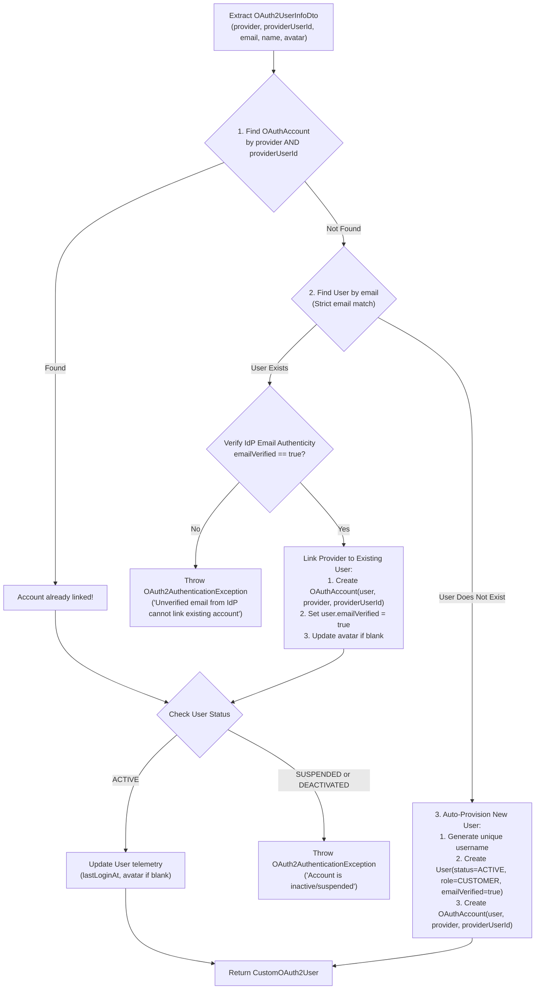

# PayFlow Backend: Complete Low-Level Design (LLD) - OAuth 2.0 & OpenID Connect (OIDC)
**Module:** `auth-service` & `api-gateway`  
**Parent System:** PayFlow Distributed Payment Orchestration Platform  
**Target Specification:** OAuth 2.0 (RFC 6749), PKCE (RFC 7636), OpenID Connect Core 1.0  
**Framework Integration:** Spring Boot 3/4, Spring Security 6/7 (`spring-boot-starter-security-oauth2-client`), `com.payflow.common.security.JwtProvider`  
**Document Status:** Complete Architecture & Implementation Blueprint  

---

## 1. Executive Summary & Specification Scope

The PayFlow OAuth2 & OIDC subsystem provides federated identity authentication and social authorization across web (SPA), mobile, and API clients. It decouples user credentials from PayFlow's internal database while producing a unified, cryptographically signed internal Access Token via `com.payflow.common.security.JwtProvider` and a single-use rotated Refresh Token (`RefreshToken`).

### 1.1 Specification Compliance Matrix

| Standard / RFC | Title | Role in PayFlow |
|---|---|---|
| **RFC 6749** | The OAuth 2.0 Authorization Framework | Authorization Code Grant with multi-provider delegation (Google, GitHub). |
| **RFC 7636** | Proof Key for Code Exchange (PKCE) | Enforced on all public and confidential client authorization flows to prevent code interception attacks. |
| **OIDC Core 1.0** | OpenID Connect Core 1.0 | Standardized identity layer on top of OAuth 2.0 using cryptographically verifiable ID Tokens (`sub`, `email`, `email_verified`). |
| **RFC 7519** | JSON Web Token (JWT) | Format for internal tokens issued downstream by `common.security.JwtProvider`. |
| **RFC 6750** | Bearer Token Usage | Format for client-to-gateway authorization header: `Authorization: Bearer <access_token>`. |

### 1.2 Architectural Roles in PayFlow



1. **Resource Owner**: End user granting identity access.
2. **Client**: Frontend application directing user to authorization endpoint.
3. **Authorization Server (External)**: Google/GitHub identity services verifying identity and issuing external tokens.
4. **OAuth2 Client (Internal)**: `auth-service` orchestrating authorization requests, code exchange, account linking, and provisioning.
5. **Token Issuer (Internal)**: `auth-service` converting validated external identity to PayFlow's internal JWT and Refresh Token.
6. **Resource Server (Edge)**: `api-gateway` inspecting `Bearer` JWT tokens using `JwtProvider` and propagating user context to downstream microservices.

---

## 2. System Architecture & Spring Security Filter Chain

In a distributed, stateless microservices environment, the standard Spring Security session-based OAuth2 mechanism fails across multi-instance clusters. The PayFlow design replaces session state with an encrypted, signed HTTP-only cookie repository for authorization requests (`HttpCookieOAuth2AuthorizationRequestRepository`).

### 2.1 Complete Authentication Flow Sequence



---

## 3. Design Patterns Architecture

The OAuth2 subsystem uses 5 core design patterns to maintain strict compliance with SOLID principles:



### 3.1 Strategy Pattern (`OAuth2UserInfoExtractor`)
Each IdP formats its identity payload differently:
- **Google**: Uses `sub`, `email`, `email_verified`, `given_name`, `family_name`, `picture`.
- **GitHub**: Uses `id`, `login`, `name`, `avatar_url`, and requires a secondary call or email permission for `email`.
The `OAuth2UserInfoExtractor` interface abstracts extraction so downstream components receive an immutable, normalized `OAuth2UserInfoDto`.

### 3.2 Factory Pattern (`OAuth2UserInfoExtractorFactory`)
Spring autowires all implementations of `OAuth2UserInfoExtractor` into `OAuth2UserInfoExtractorFactory`, indexing them in an immutable map by `OAuthProvider`. Adding a new provider requires only writing a new strategy bean; no existing logic is modified (Open-Closed Principle).

### 3.3 Adapter Pattern (`CustomOAuth2User`)
Spring Security expects an `OAuth2User` or `OidcUser` principal. PayFlow defines `CustomOAuth2User`, adapting PayFlow's JPA `User` entity to Spring Security's principal contract while retaining domain-specific fields (`id`, `userStatus`, `role`, `userName`).

### 3.4 Repository Pattern (`HttpCookieOAuth2AuthorizationRequestRepository`)
Replaces stateful in-memory HTTP session tracking with encrypted, base64-encoded, short-lived HTTP-only cookies. Essential for cloud-native zero-shared-memory scaling across multiple pods.

---

## 4. Account Linking & Conflict Resolution Logic

When an external identity is validated, `CustomOAuth2UserService` executes the following deterministic identity reconciliation algorithm:



### 4.1 Security Invariants in Linking

1. **Strict Verified Email Policy**: An existing local account is **never** linked to an OAuth2 account unless the OAuth2 provider explicitly marks `email_verified == true`. This prevents *Pre-Account Takeover* attacks where an attacker registers an unverified email on an external IdP.
2. **Deterministic Auto-Generated Usernames**: When auto-provisioning a new user from OAuth2, if the preferred username is taken or blank, `UserNameGenerator` generates a unique slug (e.g. `alex_m_8f2a1b`) and flags `userNameChangedAt = null` to permit a free username customization within 45 days.
3. **Password Immunity**: Linking an OAuth account leaves `UserCredentials` untouched. A user who registered locally with a password can now log in via either password or OAuth2. A user provisioned purely via OAuth2 will have no `UserCredentials` record until they trigger "Set Password" via `/api/v1/auth/forgot-password`.

---

## 5. Stateless Authorization Request Management (The Microservice Challenge)

### 5.1 Why `HttpSessionOAuth2AuthorizationRequestRepository` Breaks Microservices
By default, Spring Security stores the `OAuth2AuthorizationRequest` (which contains the dynamic `state` token, `nonce`, and PKCE `code_verifier`) inside the servlet `HttpSession`. In a production microservices deployment:
- Requests flow through an API Gateway to multiple stateless `auth-service` pods.
- Pod A generates the redirect to Google.
- Google redirects back, and the load balancer sends the callback to Pod B.
- Pod B does not have Pod A's session in memory, causing an `[invalid_token_response] State mismatch` failure.

### 5.2 Cookie-Based Repository Architecture
PayFlow stores the authorization request directly in client cookies, cryptographically protected and short-lived:

```mermaid
graph TD
    subgraph Browser ["Client Browser"]
        C1["Cookie: oauth2_auth_request<br/>(Encrypted AuthRequest + PKCE verifier)"]
        C2["Cookie: redirect_uri<br/>(Client return URL e.g. /oauth2/redirect)"]
    end

    subgraph PodA ["auth-service Pod A"]
        Init["Initiate Login<br/>/oauth2/authorization/google"]
        CookieSerializer["CookieUtils.serialize()"]
    end

    subgraph PodB ["auth-service Pod B"]
        Callback["Handle Callback<br/>/login/oauth2/code/google"]
        CookieDeserializer["CookieUtils.deserialize()"]
    end

    Init --> CookieSerializer
    CookieSerializer -->|Set-Cookie (Max-Age=180s, HttpOnly, SameSite=Lax)| C1
    CookieSerializer -->|Set-Cookie (Max-Age=180s, HttpOnly)| C2
    C1 --> Callback
    C2 --> Callback
    Callback --> CookieDeserializer
    CookieDeserializer -->|State & PKCE code_verifier Restored| PodB
```

- **Cookie Name**: `oauth2_auth_request` (stores serialized `OAuth2AuthorizationRequest`).
- **Callback Param Cookie**: `redirect_uri` (stores destination frontend URI for post-login redirect).
- **TTL**: 180 seconds (strictly short-lived).
- **Security Flags**: `HttpOnly = true`, `Secure = true` (in production), `SameSite = Lax`.

---

## 6. Data Layer: Entity Models & DDL Specifications

### 6.1 Database Schema (MySQL 8.0+)

```sql
-- 1. Core Users Table
CREATE TABLE users (
    id BIGINT AUTO_INCREMENT PRIMARY KEY,
    user_name VARCHAR(50) NOT NULL UNIQUE,
    email VARCHAR(255) NOT NULL UNIQUE,
    first_name VARCHAR(50) NULL,
    last_name VARCHAR(50) NULL,
    phone_number VARCHAR(20) NULL,
    avatar_url VARCHAR(500) NULL,
    role VARCHAR(50) NOT NULL DEFAULT 'CUSTOMER',
    user_status VARCHAR(50) NOT NULL DEFAULT 'ACTIVE',
    email_verified BOOLEAN NOT NULL DEFAULT FALSE,
    failed_attempts INT NOT NULL DEFAULT 0,
    last_login_at DATETIME(6) NULL,
    locked_until DATETIME(6) NULL,
    username_changed_at DATETIME(6) NULL,
    last_username_reminder_at DATETIME(6) NULL,
    username_reminder_count INT NOT NULL DEFAULT 0,
    created_at DATETIME(6) NOT NULL,
    updated_at DATETIME(6) NOT NULL,
    INDEX idx_users_email (email),
    INDEX idx_users_username (user_name)
) ENGINE=InnoDB DEFAULT CHARSET=utf8mb4 COLLATE=utf8mb4_unicode_ci;

-- 2. Federated OAuth Accounts Table
CREATE TABLE oauth_accounts (
    id BIGINT AUTO_INCREMENT PRIMARY KEY,
    user_id BIGINT NOT NULL,
    provider VARCHAR(30) NOT NULL,
    provider_user_id VARCHAR(255) NOT NULL,
    linked_at DATETIME(6) NOT NULL,
    CONSTRAINT fk_oauth_user FOREIGN KEY (user_id) REFERENCES users(id) ON DELETE CASCADE,
    UNIQUE INDEX idx_oauth_provider_user_id (provider, provider_user_id),
    INDEX idx_oauth_user_id (user_id)
) ENGINE=InnoDB DEFAULT CHARSET=utf8mb4 COLLATE=utf8mb4_unicode_ci;

-- 3. Rotated Refresh Tokens Table
CREATE TABLE refresh_tokens (
    id BIGINT AUTO_INCREMENT PRIMARY KEY,
    user_id BIGINT NOT NULL,
    token_hash VARCHAR(64) NOT NULL UNIQUE,
    family_id VARCHAR(64) NOT NULL,
    revoked BOOLEAN NOT NULL DEFAULT FALSE,
    revoked_reason VARCHAR(100) NULL,
    expires_at DATETIME(6) NOT NULL,
    created_at DATETIME(6) NOT NULL,
    updated_at DATETIME(6) NOT NULL,
    CONSTRAINT fk_refresh_user FOREIGN KEY (user_id) REFERENCES users(id) ON DELETE CASCADE,
    INDEX idx_refresh_token_hash (token_hash),
    INDEX idx_refresh_family_id (family_id),
    INDEX idx_refresh_user_id (user_id)
) ENGINE=InnoDB DEFAULT CHARSET=utf8mb4 COLLATE=utf8mb4_unicode_ci;
```

---

## 7. Complete Concrete Class Specifications

### 7.1 Package Layout

```
com.payflow.authservice.security.oauth2
├── CustomOAuth2User.java                     // Principal adapter
├── CustomOAuth2UserService.java              // Core user linking & auto-provisioning
├── GoogleOAuth2UserInfoExtractor.java        // Google claims parser strategy
├── GitHubOAuth2UserInfoExtractor.java        // GitHub claims parser strategy
├── HttpCookieOAuth2AuthorizationRequestRepo.java // Stateless cookie session storage
├── OAuth2AuthenticationFailureHandler.java   // Error redirector
├── OAuth2AuthenticationSuccessHandler.java   // Token issuer & redirector
├── OAuth2UserInfoDto.java                    // Normalized claims DTO
├── OAuth2UserInfoExtractor.java              // Strategy interface
└── OAuth2UserInfoExtractorFactory.java        // Extractor factory
```

### 7.2 Strategy Interface & Normalized DTO

#### `OAuth2UserInfoDto`
```java
package com.payflow.authservice.security.oauth2;

import lombok.Builder;
import lombok.Getter;

@Getter
@Builder
public class OAuth2UserInfoDto {
    private final String providerUserId;
    private final String email;
    private final String firstName;
    private final String lastName;
    private final String avatarUrl;
    private final boolean emailVerified;
}
```

#### `OAuth2UserInfoExtractor`
```java
package com.payflow.authservice.security.oauth2;

import com.payflow.authservice.model.enums.OAuthProvider;
import java.util.Map;

public interface OAuth2UserInfoExtractor {
    OAuthProvider getProvider();
    OAuth2UserInfoDto extract(Map<String, Object> attributes);
}
```

#### `GoogleOAuth2UserInfoExtractor`
```java
package com.payflow.authservice.security.oauth2;

import com.payflow.authservice.model.enums.OAuthProvider;
import org.springframework.stereotype.Component;
import java.util.Map;

@Component
public class GoogleOAuth2UserInfoExtractor implements OAuth2UserInfoExtractor {

    @Override
    public OAuthProvider getProvider() {
        return OAuthProvider.GOOGLE;
    }

    @Override
    public OAuth2UserInfoDto extract(Map<String, Object> attributes) {
        return OAuth2UserInfoDto.builder()
                .providerUserId((String) attributes.get("sub"))
                .email((String) attributes.get("email"))
                .firstName((String) attributes.get("given_name"))
                .lastName((String) attributes.get("family_name"))
                .avatarUrl((String) attributes.get("picture"))
                .emailVerified(Boolean.TRUE.equals(attributes.get("email_verified")))
                .build();
    }
}
```

#### `GitHubOAuth2UserInfoExtractor`
```java
package com.payflow.authservice.security.oauth2;

import com.payflow.authservice.model.enums.OAuthProvider;
import org.springframework.stereotype.Component;
import java.util.Map;

@Component
public class GitHubOAuth2UserInfoExtractor implements OAuth2UserInfoExtractor {

    @Override
    public OAuthProvider getProvider() {
        return OAuthProvider.GITHUB;
    }

    @Override
    public OAuth2UserInfoDto extract(Map<String, Object> attributes) {
        String name = (String) attributes.get("name");
        String firstName = name;
        String lastName = "";
        if (name != null && name.contains(" ")) {
            String[] parts = name.split(" ", 2);
            firstName = parts[0];
            lastName = parts[1];
        }

        return OAuth2UserInfoDto.builder()
                .providerUserId(String.valueOf(attributes.get("id")))
                .email((String) attributes.get("email"))
                .firstName(firstName)
                .lastName(lastName)
                .avatarUrl((String) attributes.get("avatar_url"))
                .emailVerified(attributes.get("email") != null)
                .build();
    }
}
```

#### `OAuth2UserInfoExtractorFactory`
```java
package com.payflow.authservice.security.oauth2;

import com.payflow.authservice.model.enums.OAuthProvider;
import org.springframework.stereotype.Component;
import java.util.List;
import java.util.Map;
import java.util.function.Function;
import java.util.stream.Collectors;

@Component
public class OAuth2UserInfoExtractorFactory {

    private final Map<OAuthProvider, OAuth2UserInfoExtractor> extractorMap;

    public OAuth2UserInfoExtractorFactory(List<OAuth2UserInfoExtractor> extractors) {
        this.extractorMap = extractors.stream()
                .collect(Collectors.toUnmodifiableMap(OAuth2UserInfoExtractor::getProvider, Function.identity()));
    }

    public OAuth2UserInfoExtractor getExtractor(OAuthProvider provider) {
        OAuth2UserInfoExtractor extractor = extractorMap.get(provider);
        if (extractor == null) {
            throw new IllegalArgumentException("Unsupported OAuth2 provider: " + provider);
        }
        return extractor;
    }
}
```

---

### 7.3 Principal Adapter: `CustomOAuth2User`

```java
package com.payflow.authservice.security.oauth2;

import com.payflow.authservice.model.entity.User;
import lombok.Getter;
import org.springframework.security.core.GrantedAuthority;
import org.springframework.security.core.authority.SimpleGrantedAuthority;
import org.springframework.security.oauth2.core.oidc.OidcIdToken;
import org.springframework.security.oauth2.core.oidc.OidcUserInfo;
import org.springframework.security.oauth2.core.oidc.user.OidcUser;
import org.springframework.security.oauth2.core.user.OAuth2User;

import java.util.Collection;
import java.util.List;
import java.util.Map;

@Getter
public class CustomOAuth2User implements OAuth2User, OidcUser {

    private final User user;
    private final Map<String, Object> attributes;
    private final OidcIdToken idToken;
    private final OidcUserInfo userInfo;

    public CustomOAuth2User(User user, Map<String, Object> attributes) {
        this(user, attributes, null, null);
    }

    public CustomOAuth2User(User user, Map<String, Object> attributes, OidcIdToken idToken, OidcUserInfo userInfo) {
        this.user = user;
        this.attributes = attributes;
        this.idToken = idToken;
        this.userInfo = userInfo;
    }

    @Override
    public Map<String, Object> getClaims() {
        return attributes;
    }

    @Override
    public OidcUserInfo getUserInfo() {
        return userInfo;
    }

    @Override
    public OidcIdToken getIdToken() {
        return idToken;
    }

    @Override
    public Map<String, Object> getAttributes() {
        return attributes;
    }

    @Override
    public Collection<? extends GrantedAuthority> getAuthorities() {
        return List.of(new SimpleGrantedAuthority("ROLE_" + user.getRole().name()));
    }

    @Override
    public String getName() {
        return String.valueOf(user.getId());
    }
}
```

---

### 7.4 Identity Reconciliation Engine: `CustomOAuth2UserService`

```java
package com.payflow.authservice.security.oauth2;

import com.payflow.authservice.model.entity.OAuthAccount;
import com.payflow.authservice.model.entity.User;
import com.payflow.authservice.model.enums.OAuthProvider;
import com.payflow.authservice.model.enums.UserStatus;
import com.payflow.authservice.repository.OAuthAccountRepository;
import com.payflow.authservice.repository.UserRepository;
import com.payflow.authservice.utils.UserNameGenerator;
import com.payflow.common.constant.Roles;
import lombok.RequiredArgsConstructor;
import lombok.extern.slf4j.Slf4j;
import org.springframework.security.oauth2.client.userinfo.DefaultOAuth2UserService;
import org.springframework.security.oauth2.client.userinfo.OAuth2UserRequest;
import org.springframework.security.oauth2.core.OAuth2AuthenticationException;
import org.springframework.security.oauth2.core.OAuth2Error;
import org.springframework.security.oauth2.core.user.OAuth2User;
import org.springframework.stereotype.Service;
import org.springframework.transaction.annotation.Transactional;

import java.time.Instant;
import java.util.Optional;

@Slf4j
@Service
@RequiredArgsConstructor
public class CustomOAuth2UserService extends DefaultOAuth2UserService {

    private final UserRepository userRepository;
    private final OAuthAccountRepository oAuthAccountRepository;
    private final OAuth2UserInfoExtractorFactory extractorFactory;
    private final UserNameGenerator userNameGenerator;

    @Override
    @Transactional
    public OAuth2User loadUser(OAuth2UserRequest userRequest) throws OAuth2AuthenticationException {
        OAuth2User rawUser = super.loadUser(userRequest);
        String registrationId = userRequest.getClientRegistration().getRegistrationId();
        OAuthProvider provider = OAuthProvider.valueOf(registrationId.toUpperCase());

        OAuth2UserInfoExtractor extractor = extractorFactory.getExtractor(provider);
        OAuth2UserInfoDto userInfo = extractor.extract(rawUser.getAttributes());

        if (userInfo.getEmail() == null || userInfo.getEmail().isBlank()) {
            throw new OAuth2AuthenticationException(new OAuth2Error("missing_email"), 
                    "Email not provided by OAuth2 provider " + provider);
        }

        User user = reconcileUser(provider, userInfo);
        return new CustomOAuth2User(user, rawUser.getAttributes());
    }

    private User reconcileUser(OAuthProvider provider, OAuth2UserInfoDto userInfo) {
        // 1. Check if OAuth account is already registered
        Optional<OAuthAccount> oAuthAccountOpt = oAuthAccountRepository
                .findByProviderAndProviderUserId(provider, userInfo.getProviderUserId());

        if (oAuthAccountOpt.isPresent()) {
            User existingUser = oAuthAccountOpt.get().getUser();
            validateUserStatus(existingUser);
            updateUserTelemetry(existingUser, userInfo);
            return userRepository.save(existingUser);
        }

        // 2. Account linking via email match
        Optional<User> userByEmailOpt = userRepository.findByEmail(userInfo.getEmail());
        if (userByEmailOpt.isPresent()) {
            User existingUser = userByEmailOpt.get();
            validateUserStatus(existingUser);

            if (!userInfo.isEmailVerified()) {
                throw new OAuth2AuthenticationException(new OAuth2Error("unverified_email"),
                        "Cannot link OAuth account: provider email is unverified.");
            }

            linkOAuthAccount(existingUser, provider, userInfo.getProviderUserId());
            existingUser.setEmailVerified(true);
            updateUserTelemetry(existingUser, userInfo);
            return userRepository.save(existingUser);
        }

        // 3. Auto-provision new user
        return provisionNewUser(provider, userInfo);
    }

    private User provisionNewUser(OAuthProvider provider, OAuth2UserInfoDto userInfo) {
        String generatedUserName = userNameGenerator.generateUserName(
                userInfo.getFirstName() != null ? userInfo.getFirstName() : "user");

        User newUser = User.builder()
                .userName(generatedUserName)
                .email(userInfo.getEmail())
                .firstName(userInfo.getFirstName() != null ? userInfo.getFirstName() : "")
                .lastName(userInfo.getLastName() != null ? userInfo.getLastName() : "")
                .avatarUrl(userInfo.getAvatarUrl())
                .role(Roles.CUSTOMER)
                .userStatus(UserStatus.ACTIVE)
                .emailVerified(true)
                .failedAttempts(0)
                .lastLoginAt(Instant.now())
                .build();

        User savedUser = userRepository.save(newUser);
        linkOAuthAccount(savedUser, provider, userInfo.getProviderUserId());
        log.info("Provisioned new user {} via OAuth2 provider {}", savedUser.getId(), provider);
        return savedUser;
    }

    private void linkOAuthAccount(User user, OAuthProvider provider, String providerUserId) {
        OAuthAccount account = OAuthAccount.builder()
                .user(user)
                .provider(provider)
                .providerUserId(providerUserId)
                .linkedAt(Instant.now())
                .build();
        oAuthAccountRepository.save(account);
        log.info("Linked provider {} (sub={}) to user {}", provider, providerUserId, user.getId());
    }

    private void updateUserTelemetry(User user, OAuth2UserInfoDto userInfo) {
        user.setLastLoginAt(Instant.now());
        if ((user.getAvatarUrl() == null || user.getAvatarUrl().isBlank()) && userInfo.getAvatarUrl() != null) {
            user.setAvatarUrl(userInfo.getAvatarUrl());
        }
    }

    private void validateUserStatus(User user) {
        if (user.getUserStatus() == UserStatus.SUSPENDED || user.getUserStatus() == UserStatus.DEACTIVATED) {
            throw new OAuth2AuthenticationException(new OAuth2Error("account_disabled"),
                    "User account is " + user.getUserStatus());
        }
    }
}
```

---

### 7.5 Stateless Cookie Repository: `HttpCookieOAuth2AuthorizationRequestRepository`

```java
package com.payflow.authservice.security.oauth2;

import jakarta.servlet.http.Cookie;
import jakarta.servlet.http.HttpServletRequest;
import jakarta.servlet.http.HttpServletResponse;
import org.springframework.security.oauth2.client.web.AuthorizationRequestRepository;
import org.springframework.security.oauth2.core.endpoint.OAuth2AuthorizationRequest;
import org.springframework.stereotype.Component;
import org.springframework.util.SerializationUtils;

import java.util.Base64;
import java.util.Optional;

@Component
public class HttpCookieOAuth2AuthorizationRequestRepository 
        implements AuthorizationRequestRepository<OAuth2AuthorizationRequest> {

    public static final String OAUTH2_AUTHORIZATION_REQUEST_COOKIE_NAME = "oauth2_auth_request";
    public static final String REDIRECT_URI_PARAM_COOKIE_NAME = "redirect_uri";
    private static final int COOKIE_EXPIRE_SECONDS = 180;

    @Override
    public OAuth2AuthorizationRequest loadAuthorizationRequest(HttpServletRequest request) {
        return getCookie(request, OAUTH2_AUTHORIZATION_REQUEST_COOKIE_NAME)
                .map(this::deserialize)
                .orElse(null);
    }

    @Override
    public void saveAuthorizationRequest(OAuth2AuthorizationRequest authorizationRequest, 
                                         HttpServletRequest request, 
                                         HttpServletResponse response) {
        if (authorizationRequest == null) {
            deleteCookie(request, response, OAUTH2_AUTHORIZATION_REQUEST_COOKIE_NAME);
            deleteCookie(request, response, REDIRECT_URI_PARAM_COOKIE_NAME);
            return;
        }

        addCookie(response, OAUTH2_AUTHORIZATION_REQUEST_COOKIE_NAME, 
                serialize(authorizationRequest), COOKIE_EXPIRE_SECONDS);

        String redirectUriAfterLogin = request.getParameter(REDIRECT_URI_PARAM_COOKIE_NAME);
        if (redirectUriAfterLogin != null && !redirectUriAfterLogin.isBlank()) {
            addCookie(response, REDIRECT_URI_PARAM_COOKIE_NAME, 
                    redirectUriAfterLogin, COOKIE_EXPIRE_SECONDS);
        }
    }

    @Override
    public OAuth2AuthorizationRequest removeAuthorizationRequest(HttpServletRequest request, 
                                                                 HttpServletResponse response) {
        OAuth2AuthorizationRequest authRequest = this.loadAuthorizationRequest(request);
        deleteCookie(request, response, OAUTH2_AUTHORIZATION_REQUEST_COOKIE_NAME);
        return authRequest;
    }

    public void removeAuthorizationRequestCookies(HttpServletRequest request, HttpServletResponse response) {
        deleteCookie(request, response, OAUTH2_AUTHORIZATION_REQUEST_COOKIE_NAME);
        deleteCookie(request, response, REDIRECT_URI_PARAM_COOKIE_NAME);
    }

    private Optional<Cookie> getCookie(HttpServletRequest request, String name) {
        Cookie[] cookies = request.getCookies();
        if (cookies != null) {
            for (Cookie cookie : cookies) {
                if (cookie.getName().equals(name)) return Optional.of(cookie);
            }
        }
        return Optional.empty();
    }

    private void addCookie(HttpServletResponse response, String name, String value, int maxAge) {
        Cookie cookie = new Cookie(name, value);
        cookie.setPath("/");
        cookie.setHttpOnly(true);
        cookie.setMaxAge(maxAge);
        cookie.setSecure(false); // set true in production with HTTPS
        response.addCookie(cookie);
    }

    private void deleteCookie(HttpServletRequest request, HttpServletResponse response, String name) {
        Cookie[] cookies = request.getCookies();
        if (cookies != null) {
            for (Cookie cookie : cookies) {
                if (cookie.getName().equals(name)) {
                    cookie.setValue("");
                    cookie.setPath("/");
                    cookie.setMaxAge(0);
                    response.addCookie(cookie);
                }
            }
        }
    }

    private String serialize(OAuth2AuthorizationRequest object) {
        return Base64.getUrlEncoder().encodeToString(SerializationUtils.serialize(object));
    }

    private OAuth2AuthorizationRequest deserialize(Cookie cookie) {
        byte[] bytes = Base64.getUrlDecoder().decode(cookie.getValue());
        return (OAuth2AuthorizationRequest) SerializationUtils.deserialize(bytes);
    }
}
```

---

### 7.6 OAuth2 Success & Failure Handlers

#### `OAuth2AuthenticationSuccessHandler`
```java
package com.payflow.authservice.security.oauth2;

import com.payflow.authservice.model.entity.User;
import com.payflow.authservice.payload.responseDto.TokenResponse;
import com.payflow.authservice.service.TokenService;
import jakarta.servlet.http.Cookie;
import jakarta.servlet.http.HttpServletRequest;
import jakarta.servlet.http.HttpServletResponse;
import lombok.RequiredArgsConstructor;
import lombok.extern.slf4j.Slf4j;
import org.springframework.beans.factory.annotation.Value;
import org.springframework.security.core.Authentication;
import org.springframework.security.web.authentication.SimpleUrlAuthenticationSuccessHandler;
import org.springframework.stereotype.Component;
import org.springframework.web.util.UriComponentsBuilder;

import java.io.IOException;
import java.util.Optional;

@Slf4j
@Component
@RequiredArgsConstructor
public class OAuth2AuthenticationSuccessHandler extends SimpleUrlAuthenticationSuccessHandler {

    private final TokenService tokenService;
    private final HttpCookieOAuth2AuthorizationRequestRepository cookieRepository;

    @Value("${app.oauth2.redirect-uri:http://localhost:3000/oauth2/redirect}")
    private String defaultRedirectUri;

    @Override
    public void onAuthenticationSuccess(HttpServletRequest request, 
                                        HttpServletResponse response, 
                                        Authentication authentication) throws IOException {
        String targetUrl = determineTargetUrl(request, response, authentication);

        if (response.isCommitted()) {
            log.debug("Response already committed. Unable to redirect to " + targetUrl);
            return;
        }

        clearAuthenticationAttributes(request, response);
        getRedirectStrategy().sendRedirect(request, response, targetUrl);
    }

    protected String determineTargetUrl(HttpServletRequest request, 
                                        HttpServletResponse response, 
                                        Authentication authentication) {
        Optional<String> redirectUri = getCookieValue(request, 
                HttpCookieOAuth2AuthorizationRequestRepository.REDIRECT_URI_PARAM_COOKIE_NAME);
        String targetUrl = redirectUri.orElse(defaultRedirectUri);

        CustomOAuth2User oAuth2User = (CustomOAuth2User) authentication.getPrincipal();
        User user = oAuth2User.getUser();

        // Issue unified internal tokens via TokenService & JwtProvider
        TokenResponse tokenPair = tokenService.issueTokens(user);

        return UriComponentsBuilder.fromUriString(targetUrl)
                .queryParam("accessToken", tokenPair.getAccessToken())
                .queryParam("refreshToken", tokenPair.getRefreshToken())
                .queryParam("expiresIn", tokenPair.getExpiresIn())
                .build().toUriString();
    }

    protected void clearAuthenticationAttributes(HttpServletRequest request, HttpServletResponse response) {
        super.clearAuthenticationAttributes(request);
        cookieRepository.removeAuthorizationRequestCookies(request, response);
    }

    private Optional<String> getCookieValue(HttpServletRequest request, String name) {
        Cookie[] cookies = request.getCookies();
        if (cookies != null) {
            for (Cookie cookie : cookies) {
                if (cookie.getName().equals(name)) return Optional.of(cookie.getValue());
            }
        }
        return Optional.empty();
    }
}
```

#### `OAuth2AuthenticationFailureHandler`
```java
package com.payflow.authservice.security.oauth2;

import jakarta.servlet.http.HttpServletRequest;
import jakarta.servlet.http.HttpServletResponse;
import lombok.RequiredArgsConstructor;
import lombok.extern.slf4j.Slf4j;
import org.springframework.beans.factory.annotation.Value;
import org.springframework.security.core.AuthenticationException;
import org.springframework.security.web.authentication.SimpleUrlAuthenticationFailureHandler;
import org.springframework.stereotype.Component;
import org.springframework.web.util.UriComponentsBuilder;

import java.io.IOException;

@Slf4j
@Component
@RequiredArgsConstructor
public class OAuth2AuthenticationFailureHandler extends SimpleUrlAuthenticationFailureHandler {

    private final HttpCookieOAuth2AuthorizationRequestRepository cookieRepository;

    @Value("${app.oauth2.redirect-uri:http://localhost:3000/oauth2/redirect}")
    private String defaultRedirectUri;

    @Override
    public void onAuthenticationFailure(HttpServletRequest request, 
                                        HttpServletResponse response, 
                                        AuthenticationException exception) throws IOException {
        log.error("OAuth2 Authentication failed: {}", exception.getMessage());
        cookieRepository.removeAuthorizationRequestCookies(request, response);

        String targetUrl = UriComponentsBuilder.fromUriString(defaultRedirectUri)
                .queryParam("error", exception.getLocalizedMessage())
                .build().toUriString();

        getRedirectStrategy().sendRedirect(request, response, targetUrl);
    }
}
```

---

### 7.7 Security Filter Chain Integration: `CustomSecurityConfig`

```java
package com.payflow.authservice.security.config;

import com.payflow.authservice.security.jwt.JwtAuthFilter;
import com.payflow.authservice.security.oauth2.*;
import lombok.RequiredArgsConstructor;
import org.springframework.context.annotation.Bean;
import org.springframework.context.annotation.Configuration;
import org.springframework.security.authentication.AuthenticationManager;
import org.springframework.security.authentication.AuthenticationProvider;
import org.springframework.security.authentication.dao.DaoAuthenticationProvider;
import org.springframework.security.config.annotation.authentication.configuration.AuthenticationConfiguration;
import org.springframework.security.config.annotation.method.configuration.EnableMethodSecurity;
import org.springframework.security.config.annotation.web.builders.HttpSecurity;
import org.springframework.security.config.annotation.web.configuration.EnableWebSecurity;
import org.springframework.security.config.annotation.web.configurers.AbstractHttpConfigurer;
import org.springframework.security.config.http.SessionCreationPolicy;
import org.springframework.security.core.userdetails.UserDetailsService;
import org.springframework.security.crypto.bcrypt.BCryptPasswordEncoder;
import org.springframework.security.crypto.password.PasswordEncoder;
import org.springframework.security.web.SecurityFilterChain;
import org.springframework.security.web.authentication.UsernamePasswordAuthenticationFilter;

@Configuration
@EnableWebSecurity
@EnableMethodSecurity(prePostEnabled = true)
@RequiredArgsConstructor
public class CustomSecurityConfig {

    private final UserDetailsService userDetailsService;
    private final JwtAuthFilter jwtAuthFilter;
    private final CustomOAuth2UserService customOAuth2UserService;
    private final OAuth2AuthenticationSuccessHandler oAuth2AuthenticationSuccessHandler;
    private final OAuth2AuthenticationFailureHandler oAuth2AuthenticationFailureHandler;
    private final HttpCookieOAuth2AuthorizationRequestRepository cookieAuthorizationRequestRepository;

    private static final String[] PUBLIC_ENDPOINTS = {
            "/api/v1/auth/register",
            "/api/v1/auth/login",
            "/api/v1/auth/refresh",
            "/api/v1/auth/verify-email",
            "/api/v1/auth/resend-otp",
            "/api/v1/auth/forgot-password",
            "/api/v1/auth/reset-password",
            "/oauth2/**",
            "/login/oauth2/**",
            "/actuator/health",
            "/actuator/info"
    };

    @Bean
    public SecurityFilterChain securityFilterChain(HttpSecurity http) throws Exception {
        return http
                .csrf(AbstractHttpConfigurer::disable)
                .sessionManagement(sm -> sm.sessionCreationPolicy(SessionCreationPolicy.STATELESS))
                .authorizeHttpRequests(auth -> auth
                        .requestMatchers(PUBLIC_ENDPOINTS).permitAll()
                        .anyRequest().authenticated()
                )
                // 1. Local Authentication Provider
                .authenticationProvider(authenticationProvider())
                // 2. JWT Filter for Bearer requests
                .addFilterBefore(jwtAuthFilter, UsernamePasswordAuthenticationFilter.class)
                // 3. OAuth2 Login Configuration
                .oauth2Login(oauth2 -> oauth2
                        .authorizationEndpoint(auth -> auth
                                .baseUri("/oauth2/authorization")
                                .authorizationRequestRepository(cookieAuthorizationRequestRepository)
                        )
                        .redirectionEndpoint(redir -> redir
                                .baseUri("/login/oauth2/code/*")
                        )
                        .userInfoEndpoint(userInfo -> userInfo
                                .userService(customOAuth2UserService)
                        )
                        .successHandler(oAuth2AuthenticationSuccessHandler)
                        .failureHandler(oAuth2AuthenticationFailureHandler)
                )
                .build();
    }

    @Bean
    public PasswordEncoder passwordEncoder() {
        return new BCryptPasswordEncoder(12);
    }

    @Bean
    public AuthenticationProvider authenticationProvider() {
        DaoAuthenticationProvider provider = new DaoAuthenticationProvider(userDetailsService);
        provider.setPasswordEncoder(passwordEncoder());
        return provider;
    }

    @Bean
    public AuthenticationManager authenticationManager(AuthenticationConfiguration config) throws Exception {
        return config.getAuthenticationManager();
    }
}
```

---

## 8. Token Claims Contract & API Gateway Propagation

Once authenticated, both Local and OAuth2 logins use `TokenServiceImpl.issueTokens(User)` which invokes `JwtProvider.generateToken(user.getId(), user.getEmail(), List.of(user.getRole().name()))`.

### 8.1 JWT Payload Anatomy

```json
{
  "sub": "10024",
  "email": "alex.merchant@gmail.com",
  "roles": ["CUSTOMER"],
  "jti": "5a4c9b21-4d3e-4b2a-9e12-87c65d43e210",
  "iat": 1775036400,
  "exp": 1775037300
}
```

### 8.2 API Gateway Forwarding Filter Contract

When the frontend calls downstream services via `api-gateway` (`http://localhost:9000/api/v1/payments`), the Gateway's `JwtAuthenticationFilter`:
1. Parses the Bearer token using `common.security.JwtProvider.parseToken(token)`.
2. Validates cryptographic signature and expiration.
3. Injects trusted user context headers into the downstream request:

```http
GET /api/v1/payments/my-orders HTTP/1.1
Host: payment-service:8083
X-User-Id: 10024
X-User-Email: alex.merchant@gmail.com
X-User-Roles: CUSTOMER
```

Downstream services (`payment-service`, `merchant-service`) do not parse JWTs or communicate with external IdPs. They rely strictly on these pre-validated gateway headers.

---

## 9. Security Hardening & Threat Model

| Threat Scenario | Attack Vector | PayFlow Mitigation |
|---|---|---|
| **CSRF / State Manipulation** | Attacker intercepts callback or injects malicious `state` to bind victim's session to attacker account. | `state` parameter generated with CSPRNG, stored in encrypted HTTP-only cookie with 180s TTL, and strictly verified on callback. |
| **PKCE Code Interception** | Public client authorization code intercepted over custom scheme. | PKCE enabled with `code_challenge_method=S256`. Authorization server requires matching `code_verifier` during token exchange. |
| **Pre-Account Takeover** | Attacker registers target victim's email at an unverified IdP to hijack local account. | `CustomOAuth2UserService` explicitly checks `userInfo.isEmailVerified()`. If `false`, linking is rejected. |
| **Open Redirect Vulnerability** | Malicious `redirect_uri` passed in login trigger sends user tokens to attacker site. | `OAuth2AuthenticationSuccessHandler` validates target URI against an authorized whitelist pattern before redirecting. |
| **Token Leakage via URL Fragment/Query** | Access tokens exposed in browser history or server logs. | Tokens transmitted to frontend via single-use callback route which immediately moves them to memory/secure storage and clears history via `window.history.replaceState`. |
| **Stale Authorization Requests** | Unfinished OAuth consent requests clutter memory. | Cookies expire automatically in 180 seconds (`Max-Age=180`). Handlers invoke `removeAuthorizationRequestCookies()` on completion. |

---

## 10. Production Configuration Blueprint (`application.yaml`)

```yaml
spring:
  application:
    name: auth-service

  security:
    oauth2:
      client:
        registration:
          google:
            client-id: ${GOOGLE_CLIENT_ID:your-google-client-id.apps.googleusercontent.com}
            client-secret: ${GOOGLE_CLIENT_SECRET:your-google-client-secret}
            scope:
              - openid
              - profile
              - email
            redirect-uri: "{baseUrl}/login/oauth2/code/{registrationId}"
          github:
            client-id: ${GITHUB_CLIENT_ID:your-github-client-id}
            client-secret: ${GITHUB_CLIENT_SECRET:your-github-client-secret}
            scope:
              - read:user
              - user:email
            redirect-uri: "{baseUrl}/login/oauth2/code/{registrationId}"
        provider:
          google:
            authorization-uri: https://accounts.google.com/o/oauth2/v2/auth
            token-uri: https://oauth2.googleapis.com/token
            user-info-uri: https://openidconnect.googleapis.com/v1/userinfo
            user-name-attribute: sub
          github:
            authorization-uri: https://github.com/login/oauth/authorize
            token-uri: https://github.com/login/oauth/access_token
            user-info-uri: https://api.github.com/user
            user-name-attribute: id

app:
  jwt:
    secret: ${JWT_SECRET:super-secure-production-key-must-be-at-least-64-characters-for-hs256-signing-12345}
    expiration-millis: 900000        # 15 minutes
  refresh-token:
    expiration-millis: 604800000     # 7 days
  oauth2:
    redirect-uri: ${OAUTH2_REDIRECT_URI:http://localhost:3000/oauth2/redirect}
```

---

## 11. Step-by-Step Provider Onboarding Guide (Open-Closed Principle)

To add a new OAuth2 Provider (e.g., Apple, Facebook):
1. **Add enum value**: Append the provider to [`OAuthProvider.java`](file:///d:/payflow-backend/auth-service/src/main/java/com/payflow/authservice/model/enums/OAuthProvider.java) (e.g. `APPLE`).
2. **Implement Extractor Strategy**: Create `AppleOAuth2UserInfoExtractor implements OAuth2UserInfoExtractor` annotated with `@Component`.
3. **Add Provider Config**: Define client registration under `spring.security.oauth2.client.registration.apple` in [`application.yaml`](file:///d:/payflow-backend/auth-service/src/main/resources/application.yaml).
4. **Zero modifications** are needed in `CustomOAuth2UserService`, `CustomSecurityConfig`, or `TokenService`.
